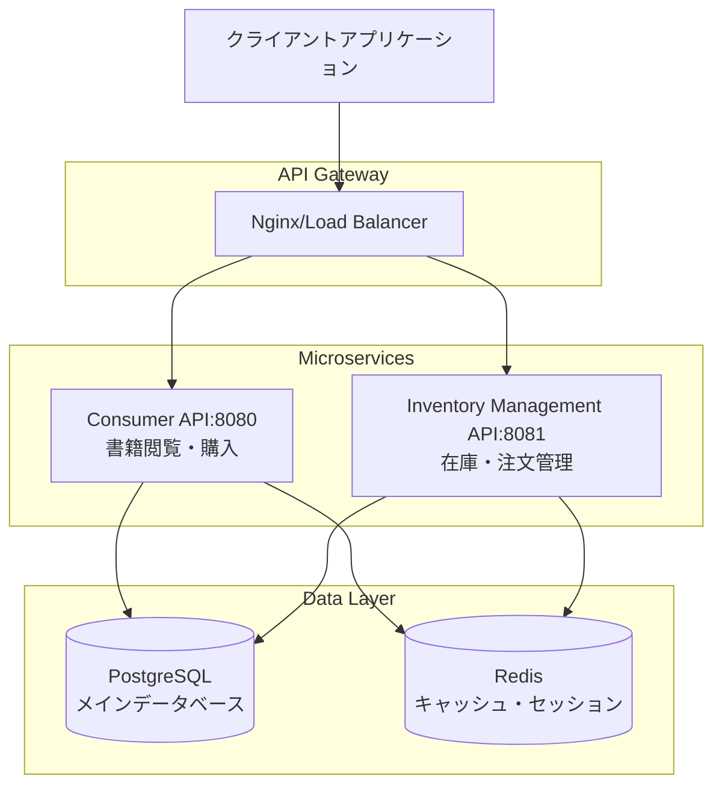

# Readscape-JP ドキュメント

## 概要

Readscape-JPは日本語対応の書籍販売システムです。このドキュメントディレクトリには、システムの設計、開発、運用に関するすべての技術文書が含まれています。

## ドキュメント構成

### 📚 API ドキュメント (`/api/`)

| ファイル名 | 説明 | 対象読者 |
|---|---|---|
| [`manual.md`](./api/manual.md) | Consumer API（エンドユーザー向け）の技術仕様書 | 開発者 |
| [`user-guide.md`](./api/user-guide.md) | API全体の利用ガイド・統合ドキュメント | 開発者・システム管理者 |
| [`authentication-guide.md`](./api/authentication-guide.md) | JWT認証システムの詳細ガイド | 開発者・システム管理者 |
| [`troubleshooting.md`](./api/troubleshooting.md) | API利用時のトラブルシューティング | 開発者・サポート |
| **[`api-guide.md`](./api/api-guide.md)** | **完全なAPI利用手順・クイックスタート** | **開発者** |
| **[`error-codes.md`](./api/error-codes.md)** | **全エラーコード仕様・対処法** | **開発者・サポート** |
| **[`authentication-flow.md`](./api/authentication-flow.md)** | **JWT認証フローの詳細実装ガイド** | **開発者** |

### 🗄️ データベース設計 (`/database/`)

| ファイル名 | 説明 | 対象読者 |
|---|---|---|
| [`schema-design.md`](./database/schema-design.md) | データベーススキーマ設計とER図 | データベース管理者・開発者 |

### 🏗️ 技術アーキテクチャ (`/technical/`)

| ファイル名 | 説明 | 対象読者 |
|---|---|---|
| [`architecture-design.md`](./technical/architecture-design.md) | システム全体のアーキテクチャ設計 | アーキテクト・開発者 |
| [`technology-selection.md`](./technical/technology-selection.md) | 技術選定の根拠と説明 | アーキテクト・開発者 |
| [`security-architecture.md`](./technical/security-architecture.md) | セキュリティアーキテクチャと対策 | セキュリティエンジニア・開発者 |

### 📏 開発標準 (`/standards/`)

| ファイル名 | 説明 | 対象読者 |
|---|---|---|
| [`java-coding-standards.md`](./standards/java-coding-standards.md) | Javaコーディング規約・開発標準 | Java開発者 |

### 📋 プロジェクト管理 (`/projects/`)

プロジェクトの計画、進捗管理、品質向上施策などが含まれています。

## システムアーキテクチャ概要



## 主要機能

### Consumer API（一般消費者向け）
- **書籍検索・閲覧**: カテゴリー別、キーワード検索、人気書籍
- **ユーザー認証**: JWT認証、アカウント管理
- **ショッピング**: カート管理、注文処理
- **レビューシステム**: 評価・レビュー投稿

### Inventory Management API（管理者向け）
- **書籍管理**: 新規登録、編集、削除
- **在庫管理**: 入荷・出荷管理、在庫追跡
- **注文管理**: 注文状況確認、配送管理
- **分析・レポート**: 売上分析、在庫レポート

## 技術スタック

### バックエンド
- **Java 21**: メイン開発言語
- **Spring Boot 3.2**: アプリケーションフレームワーク
- **Spring Security**: 認証・認可
- **Spring Data JPA**: データアクセス層
- **PostgreSQL 15**: メインデータベース
- **Redis**: キャッシュ・セッション管理
- **Flyway**: データベースマイグレーション

### 開発・運用ツール
- **Docker & Docker Compose**: コンテナ化
- **OpenAPI 3.0**: API仕様書
- **JUnit 5**: 単体テスト
- **TestContainers**: 統合テスト
- **JaCoCo**: テストカバレッジ

## 環境構成

| 環境 | Consumer API | Inventory API | データベース | 用途 |
|---|---|---|---|---|
| 開発 | http://localhost:8080 | http://localhost:8081 | localhost:5432 | 開発・テスト |
| ステージング | https://consumer-api-dev.readscape.jp | https://inventory-api-dev.readscape.jp | staging-db | 統合テスト |
| 本番 | https://consumer-api.readscape.jp | https://inventory-api.readscape.jp | production-db | 本番運用 |

## セキュリティ対策

- **JWT認証**: アクセストークンとリフレッシュトークンによる認証
- **RBAC**: ロールベースアクセス制御（CONSUMER, MANAGER, ADMIN）
- **レート制限**: API呼び出し頻度制限
- **HTTPS強制**: 全通信の暗号化
- **セキュリティヘッダー**: XSS、CSRF対策
- **監査ログ**: セキュリティイベントの記録

## 開発・運用ガイド

### 開発環境セットアップ
```bash
# リポジトリクローン
git clone https://github.com/your-org/readscape-jp.git
cd readscape-jp

# 依存サービス起動（PostgreSQL, Redis）
docker-compose up -d postgres redis

# Consumer API起動
cd consumer-api
./gradlew bootRun

# Inventory Management API起動
cd ../inventory-management-api
./gradlew bootRun
```

### テスト実行
```bash
# 単体テスト
./gradlew test

# 統合テスト
./gradlew integrationTest

# カバレッジレポート生成
./gradlew jacocoTestReport
```

### データベースマイグレーション
```bash
# マイグレーション実行
./gradlew flywayMigrate

# マイグレーション状態確認
./gradlew flywayInfo
```

## API エンドポイント概要

### Consumer API主要エンドポイント
- `GET /api/books` - 書籍一覧取得
- `GET /api/books/{id}` - 書籍詳細取得
- `POST /api/auth/login` - ユーザーログイン
- `GET/POST/PUT/DELETE /api/cart` - カート操作
- `POST /api/orders` - 注文作成

### Inventory Management API主要エンドポイント
- `GET/POST/PUT/DELETE /api/admin/books` - 書籍管理
- `POST /api/admin/inventory/{id}/stock` - 在庫更新
- `GET /api/admin/orders` - 注文管理
- `GET /api/admin/analytics/sales` - 売上分析

## ドキュメント更新ガイドライン

### 文書作成・更新時の注意点

1. **対象読者の明確化**: 各文書の対象読者を明記する
2. **最新性の維持**: システム変更時は関連文書も同時に更新する
3. **実例の提供**: コード例、リクエスト・レスポンス例を含める
4. **図表の活用**: 複雑な概念は図表で説明する
5. **検索性の確保**: 適切な見出し構造とキーワードを使用する

### 文書のバージョン管理

- すべての文書はGitで管理され、システムのバージョンと同期する
- 大きな変更の際は文書内にバージョン情報と変更履歴を記載する
- API仕様の変更時は必ず関連文書も同時に更新する

## サポート・問い合わせ

### 開発者向けサポート
- **技術的な質問**: api-support@readscape.jp
- **GitHub Issues**: https://github.com/readscape-jp/api-issues
- **開発者フォーラム**: https://forum.readscape.jp/api

### システム管理者向けサポート
- **システム運用**: ops-support@readscape.jp
- **セキュリティ関連**: security@readscape.jp

## ライセンス

このプロジェクトのドキュメントはMITライセンスの下で提供されています。

---

**最終更新**: 2024年1月15日  
**文書バージョン**: v1.0.0  
**システムバージョン**: v0.0.1-SNAPSHOT