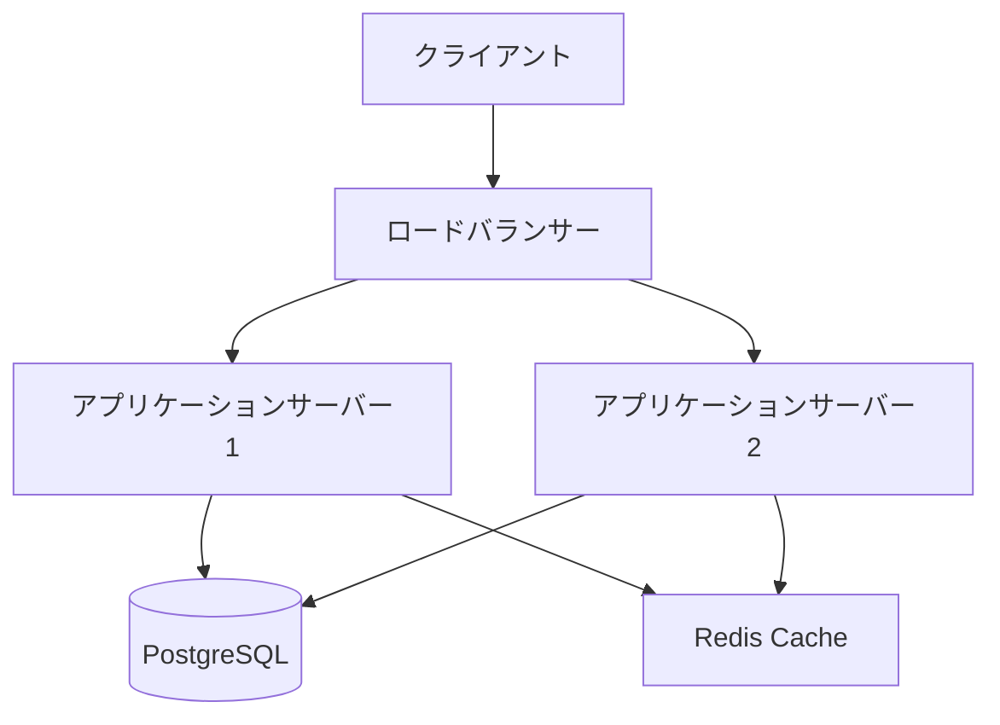
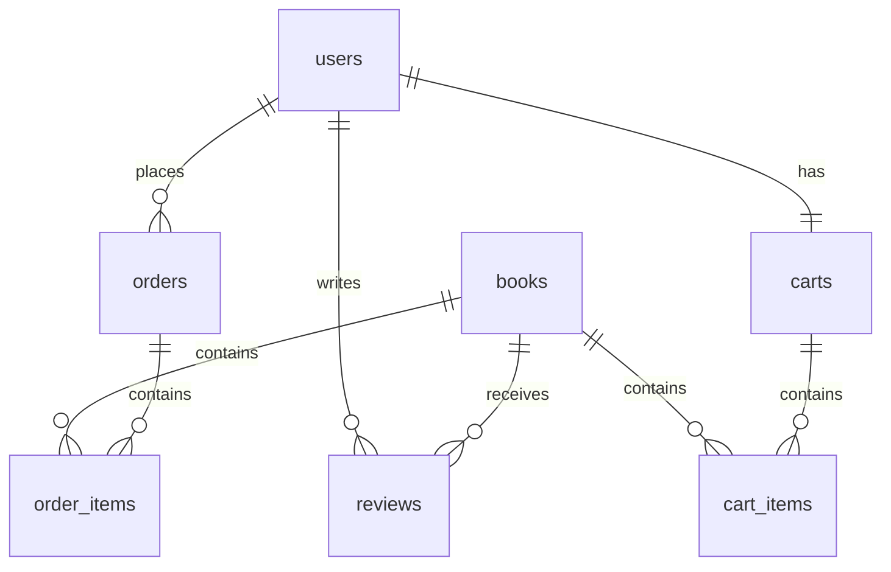

# 3.2 プロジェクト文書

## 概要
プロジェクトの目標設定、進捗管理、技術仕様を文書化し、開発チーム全体での情報共有を促進します。

## プロジェクトゴール

### 文書構成
- `docs/goals/README.md`: プロジェクト最終ゴールの定義
- `docs/goals/COMPOSITION.md`: 作成物軸での整理
- `docs/goals/subgoals/`: 詳細なサブゴール文書群

### ゴール文書の更新管理
```markdown
# 更新履歴管理例
## 変更履歴

| 日付 | バージョン | 変更内容 | 担当者 |
|------|------------|----------|--------|
| 2024-01-15 | v1.0 | 初版作成 | 開発チーム |
| 2024-01-20 | v1.1 | API分割に伴う目標更新 | プロダクトオーナー |
| 2024-01-25 | v1.2 | セキュリティ要件追加 | セキュリティチーム |
```

### 成功指標の定量化
```markdown
## KPI（重要業績評価指標）

### 技術指標
- API レスポンス時間: 平均 < 200ms
- データベースクエリ実行時間: < 100ms
- アプリケーション起動時間: < 30秒
- テストカバレッジ: > 80%

### 機能指標
- 書籍検索機能の正確性: > 95%
- ユーザー認証成功率: > 99%
- 注文処理成功率: > 99.5%
- データ整合性: 100%

### 運用指標
- システム稼働率: > 99.9%
- セキュリティインシデント: 0件
- データ損失: 0件
- 復旧時間: < 1時間
```

## マイルストーン

### マイルストーン文書テンプレート
```markdown
# マイルストーン - YYYY年MM月DD日

## 完了済み作業
- [x] データベーススキーマ設計
- [x] 基本的なCRUD API実装
- [x] ユーザー認証システム実装

## 進行中の作業
- [ ] レビュー機能の実装（進捗: 60%）
- [ ] 管理者向けダッシュボード（進捗: 30%）

## 次期マイルストーンまでの予定
- [ ] 決済システム連携
- [ ] パフォーマンステスト実施
- [ ] セキュリティ監査

## 課題・リスク
- 外部決済API の仕様変更対応が必要
- データベースパフォーマンスの改善が必要

## メトリクス
- コードカバレッジ: 78%
- 実装完了率: 65%
- バグ修正率: 95%
```

### 進捗追跡ツール連携
- GitHub Issues との連携
- プロジェクト管理ツール（Jira, Trello）との同期
- 自動レポート生成機能

## 技術仕様

### アーキテクチャ設計書
```markdown
# システムアーキテクチャ

## 全体構成


## レイヤー構成
- **プレゼンテーション層**: REST Controller
- **アプリケーション層**: Service Layer
- **ドメイン層**: Entity, Repository Interface
- **インフラストラクチャ層**: Repository Implementation, External API
```

### 技術選定理由書
```markdown
# 技術選定理由

## データベース: PostgreSQL
### 選定理由
- ACID準拠で高い信頼性
- 豊富な機能（JSON型、全文検索など）
- Spring Boot との親和性が高い
- 大規模データに対応可能

### 比較検討技術
- MySQL: 機能面でPostgreSQLに劣る
- MongoDB: ACID準拠でない、関係性データに不向き

## フレームワーク: Spring Boot
### 選定理由
- Java エコシステムの成熟度
- 豊富なライブラリとドキュメント
- 企業での採用実績が豊富
- セキュリティ機能が充実

### 比較検討技術
- Express.js: JavaScript、型安全性に課題
- Django: Python、パフォーマンス面で劣る
```

### コーディング規約
```markdown
# コーディング規約

## ファイル構成規約
```
src/main/java/jp/readscape/api/
├── configurations/        # 設定クラス
├── controllers/           # REST コントローラー
├── services/             # ビジネスロジック
├── repositories/         # データアクセス層
├── entities/             # エンティティクラス
├── dto/                  # データ転送オブジェクト
├── exceptions/           # 例外クラス
└── utils/               # ユーティリティクラス
```

## 命名規約
- クラス名: PascalCase (`BookController`)
- メソッド名: camelCase (`findBookById`)
- 定数: UPPER_SNAKE_CASE (`MAX_RETRY_COUNT`)
- パッケージ名: lowercase (`jp.readscape.api.controllers`)

## アノテーション使用規約
- `@RestController`: REST エンドポイント
- `@Service`: ビジネスロジック
- `@Repository`: データアクセス
- `@Valid`: バリデーション
- `@Transactional`: トランザクション管理
```

### データベース設計書
```markdown
# データベース設計書

## ER図


## テーブル設計原則
1. 主キーは必ずSERIAL型を使用
2. 外部キー制約を必ず設定
3. NOT NULL制約を適切に設定
4. 検索対象フィールドにはインデックスを作成
5. 論理削除は使用せず、物理削除を基本とする
```

## セキュリティ設計書
```markdown
# セキュリティ設計

## 認証・認可方針
- JWT を使用したステートレス認証
- ロールベースアクセス制御（RBAC）
- API レベルでの認可チェック

## データ保護
- パスワードのハッシュ化（bcrypt）
- 個人情報の暗号化
- SQLインジェクション対策
- XSS攻撃対策

## 監査ログ
- 管理者操作の全記録
- 個人情報アクセスログ
- セキュリティイベントの記録
```

## 文書管理プロセス

### 更新フロー
1. 文書更新提案（Pull Request）
2. 技術レビューア承認
3. プロダクトオーナー承認
4. マージ・公開

### バージョン管理
- セマンティックバージョニング適用
- 破壊的変更時はメジャーバージョンアップ
- 機能追加時はマイナーバージョンアップ
- バグ修正時はパッチバージョンアップ

### レビュー体制
- 技術文書: シニアエンジニア
- 仕様文書: プロダクトオーナー + エンジニア
- セキュリティ関連: セキュリティ担当者必須

## 技術仕様
- 文書フォーマット: Markdown
- 図表作成: Mermaid.js
- バージョン管理: Git
- 自動生成: GitHub Actions
- 配信: GitHub Pages または社内Wiki