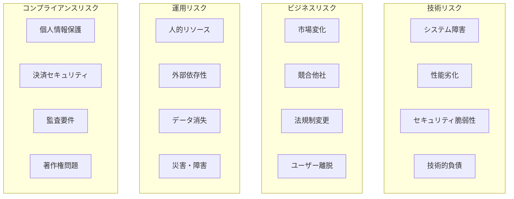
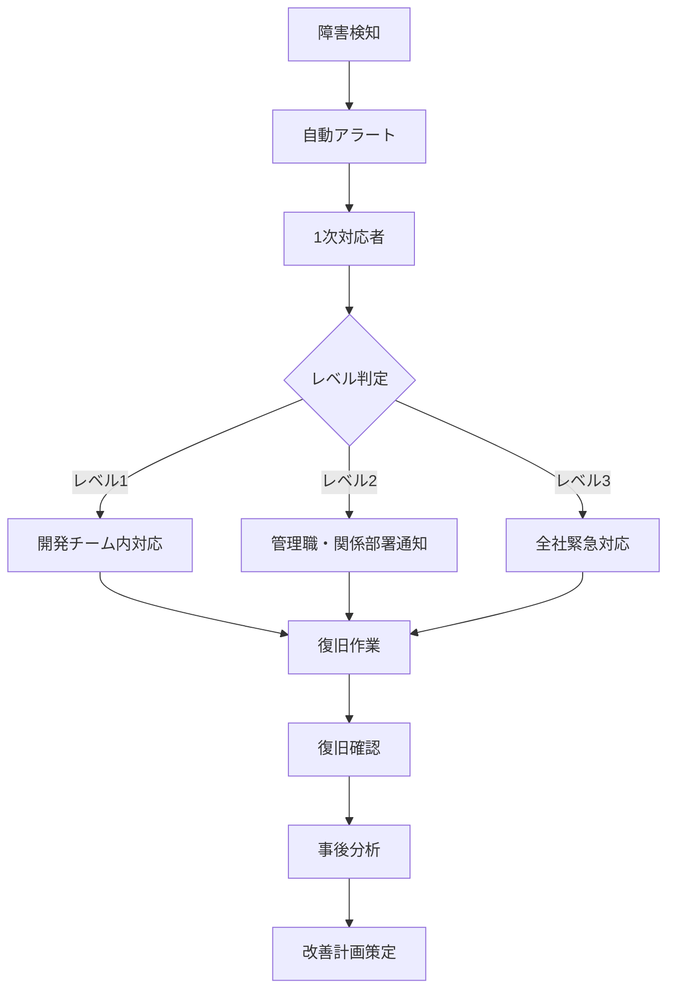

# Readscape-JP リスク管理ガイド

## 概要

Readscape-JPプロジェクトにおける各種リスクの識別、評価、対策、監視に関するガイドラインです。プロジェクトの継続的な成功を確保するため、技術リスク、ビジネスリスク、運用リスクを体系的に管理します。

## リスク管理フレームワーク

### 1. リスク分類



### 2. リスク評価マトリクス

| 影響度 | 発生確率 | Low (1) | Medium (2) | High (3) |
|--------|----------|---------|------------|----------|
| **High (3)** | 3 | 6 | 9 |
| **Medium (2)** | 2 | 4 | 6 |
| **Low (1)** | 1 | 2 | 3 |

**リスクレベル**:
- **9-8**: Critical（緊急対応必要）
- **6-4**: High（優先対応）
- **3-2**: Medium（計画的対応）
- **1**: Low（監視継続）

## 技術リスク管理

### 1. システム障害リスク

#### リスク内容
- **API サーバー停止**: アプリケーション例外、リソース不足
- **データベース障害**: 接続不能、データ破損、性能劣化
- **ネットワーク障害**: 外部サービス接続エラー

#### 対策・監視

**予防措置**:
```yaml
# docker-compose.yml - ヘルスチェック設定
services:
  consumer-api:
    healthcheck:
      test: ["CMD", "curl", "-f", "http://localhost:8080/actuator/health"]
      interval: 30s
      timeout: 10s
      retries: 3
      start_period: 40s
    deploy:
      replicas: 3
      restart_policy:
        condition: on-failure
        delay: 5s
        max_attempts: 3
```

**監視・アラート設定**:
```yaml
# Prometheus alerts
groups:
- name: system-failure
  rules:
  - alert: ServiceDown
    expr: up{job="readscape-api"} == 0
    for: 1m
    labels:
      severity: critical
    annotations:
      summary: "Service {{ $labels.instance }} is down"
      
  - alert: DatabaseConnectionFailure
    expr: postgresql_up == 0
    for: 2m
    labels:
      severity: critical
    annotations:
      summary: "Database connection failed"
      
  - alert: HighMemoryUsage
    expr: (node_memory_MemTotal_bytes - node_memory_MemAvailable_bytes) / node_memory_MemTotal_bytes > 0.9
    for: 5m
    labels:
      severity: warning
    annotations:
      summary: "High memory usage detected"
```

**復旧手順**:
```bash
#!/bin/bash
# 緊急復旧スクリプト

set -e

echo "=== Readscape-JP Emergency Recovery ==="

# 1. サービス状態確認
echo "Checking service status..."
curl -f http://localhost:8080/actuator/health || echo "Consumer API is down"
curl -f http://localhost:8081/actuator/health || echo "Inventory API is down"

# 2. ログ確認
echo "Checking recent logs..."
docker-compose logs --tail=50 consumer-api
docker-compose logs --tail=50 inventory-api

# 3. リソース確認
echo "Checking resources..."
df -h
free -h
docker stats --no-stream

# 4. サービス再起動
echo "Restarting services..."
docker-compose restart consumer-api inventory-api

# 5. ヘルスチェック
echo "Waiting for services to recover..."
for i in {1..30}; do
    if curl -f http://localhost:8080/actuator/health > /dev/null 2>&1; then
        echo "Consumer API is healthy"
        break
    fi
    echo "Waiting for Consumer API... ($i/30)"
    sleep 10
done

# 6. 通知
echo "Sending recovery notification..."
curl -X POST https://hooks.slack.com/services/... \
  -H 'Content-type: application/json' \
  -d '{"text":"🚨 Readscape-JP services have been restarted and are now healthy"}'
```

### 2. セキュリティリスク

#### リスク内容
- **認証バイパス**: JWT トークンの不正利用
- **SQLインジェクション**: 入力値検証不備
- **個人情報漏洩**: 不適切なアクセス制御

#### 対策実装

**セキュリティ設定強化**:
```java
// SecurityConfig.java
@Configuration
@EnableWebSecurity
@EnableMethodSecurity(prePostEnabled = true)
public class SecurityConfig {
    
    @Bean
    public SecurityFilterChain filterChain(HttpSecurity http) throws Exception {
        http
            .sessionManagement(session -> session.sessionCreationPolicy(SessionCreationPolicy.STATELESS))
            .authorizeHttpRequests(auth -> auth
                .requestMatchers("/actuator/health").permitAll()
                .requestMatchers("/api/auth/**").permitAll()
                .requestMatchers("/api/books/**").permitAll()  // 読み取りのみ
                .requestMatchers("/api/admin/**").hasRole("ADMIN")
                .anyRequest().authenticated())
            .oauth2ResourceServer(oauth2 -> oauth2.jwt(Customizer.withDefaults()))
            .headers(headers -> headers
                .frameOptions().deny()
                .contentTypeOptions(Customizer.withDefaults())
                .httpStrictTransportSecurity(hstsConfig -> hstsConfig
                    .maxAgeInSeconds(31536000)
                    .includeSubdomains(true)))
            .csrf(csrf -> csrf.disable()); // JWT使用時は無効化
            
        return http.build();
    }
}
```

**セキュリティ監視**:
```sql
-- セキュリティイベント監視
CREATE TABLE security_events (
    id BIGSERIAL PRIMARY KEY,
    event_type VARCHAR(50) NOT NULL,
    user_id BIGINT,
    ip_address INET NOT NULL,
    user_agent TEXT,
    request_path VARCHAR(500),
    risk_level VARCHAR(20) NOT NULL,
    description TEXT,
    created_at TIMESTAMP WITH TIME ZONE NOT NULL DEFAULT NOW()
);

-- 異常検知クエリ
SELECT 
    ip_address,
    COUNT(*) as failed_attempts,
    COUNT(DISTINCT user_id) as targeted_users,
    MIN(created_at) as first_attempt,
    MAX(created_at) as last_attempt
FROM security_events 
WHERE event_type = 'LOGIN_FAILURE'
    AND created_at >= CURRENT_DATE - INTERVAL '1 hour'
GROUP BY ip_address
HAVING COUNT(*) >= 10
ORDER BY failed_attempts DESC;
```

### 3. パフォーマンスリスク

#### リスク内容
- **レスポンス時間劣化**: データ量増加、クエリ最適化不備
- **同時接続数上限**: トラフィック急増時の処理能力不足
- **メモリリーク**: 長時間運用によるリソース枯渇

#### 対策実装

**性能監視・アラート**:
```java
// PerformanceMonitoringAspect.java
@Aspect
@Component
@Slf4j
public class PerformanceMonitoringAspect {
    
    private final MeterRegistry meterRegistry;
    
    @Around("@annotation(MonitorPerformance)")
    public Object monitorExecution(ProceedingJoinPoint joinPoint) throws Throwable {
        String methodName = joinPoint.getSignature().getName();
        Timer.Sample sample = Timer.start(meterRegistry);
        
        try {
            Object result = joinPoint.proceed();
            meterRegistry.counter("method.execution.success", "method", methodName).increment();
            return result;
        } catch (Exception e) {
            meterRegistry.counter("method.execution.error", "method", methodName, "exception", e.getClass().getSimpleName()).increment();
            throw e;
        } finally {
            sample.stop(Timer.builder("method.execution.time")
                .tag("method", methodName)
                .register(meterRegistry));
        }
    }
}
```

**パフォーマンステストの自動化**:
```yaml
# .github/workflows/performance-test.yml
name: Performance Test

on:
  schedule:
    - cron: '0 2 * * *'  # 毎日2時に実行
  workflow_dispatch:

jobs:
  performance-test:
    runs-on: ubuntu-latest
    steps:
    - uses: actions/checkout@v3
    
    - name: Setup JMeter
      run: |
        wget https://archive.apache.org/dist/jmeter/binaries/apache-jmeter-5.5.tgz
        tar -xzf apache-jmeter-5.5.tgz
        
    - name: Run performance tests
      run: |
        ./apache-jmeter-5.5/bin/jmeter -n -t performance-tests/load-test.jmx \
          -l results.jtl -e -o html-report/
          
    - name: Analyze results
      run: |
        # 結果分析・閾値チェック
        python scripts/analyze-performance.py results.jtl
        
    - name: Upload results
      uses: actions/upload-artifact@v3
      with:
        name: performance-results
        path: html-report/
```

## データ保護・バックアップ戦略

### 1. データバックアップリスク

#### 自動バックアップシステム
```bash
#!/bin/bash
# 自動バックアップスクリプト

set -e

BACKUP_DIR="/backups/readscape"
DB_HOST="localhost"
DB_NAME="readscape_production"
DB_USER="backup_user"
RETENTION_DAYS=30

# バックアップディレクトリ作成
mkdir -p "${BACKUP_DIR}/$(date +%Y/%m)"

# データベースバックアップ
BACKUP_FILE="${BACKUP_DIR}/$(date +%Y/%m)/readscape_$(date +%Y%m%d_%H%M%S).sql"

echo "Creating database backup: ${BACKUP_FILE}"
pg_dump -h $DB_HOST -U $DB_USER -d $DB_NAME \
  --format=custom \
  --compress=9 \
  --file="${BACKUP_FILE}"

# バックアップ検証
echo "Verifying backup integrity..."
pg_restore --list "${BACKUP_FILE}" > /dev/null

# 古いバックアップの削除
find "${BACKUP_DIR}" -name "*.sql" -mtime +${RETENTION_DAYS} -delete

# S3へのアップロード（オプション）
if [ "$UPLOAD_TO_S3" = "true" ]; then
    aws s3 cp "${BACKUP_FILE}" "s3://readscape-backups/database/"
fi

# 通知
echo "Backup completed successfully: ${BACKUP_FILE}"
```

### 2. 災害復旧計画（DR: Disaster Recovery）

#### RTO/RPO目標
- **RTO（復旧時間目標）**: 4時間以内
- **RPO（復旧時点目標）**: 1時間以内のデータ損失

#### DR手順
```yaml
災害復旧手順:
  レベル1_部分障害:
    対象: 単一サービス障害
    復旧時間: 15分以内
    手順:
      - 自動フェイルオーバー
      - ヘルスチェック確認
      - ログ分析・原因調査
      
  レベル2_システム障害:
    対象: 複数サービス障害
    復旧時間: 2時間以内
    手順:
      - インシデント宣言
      - バックアップからの復旧
      - データ整合性確認
      
  レベル3_全システム停止:
    対象: データセンター全体障害
    復旧時間: 4時間以内
    手順:
      - DRサイトへの切り替え
      - DNS設定変更
      - 全サービス復旧確認
```

## 外部依存リスク

### 1. サードパーティサービス

#### 依存サービス一覧
```yaml
外部依存サービス:
  決済:
    - サービス: Stripe, PayPal
    - リスク: サービス停止、API変更
    - 対策: 複数決済手段、フォールバック機能
    
  メール配信:
    - サービス: SendGrid, Amazon SES
    - リスク: 配信遅延、スパム判定
    - 対策: 複数プロバイダー、配信状況監視
    
  画像ストレージ:
    - サービス: Amazon S3, Cloudflare
    - リスク: アクセス障害、コスト増加
    - 対策: CDN、キャッシュ戦略
    
  認証プロバイダー:
    - サービス: Auth0, Firebase Auth
    - リスク: サービス停止、仕様変更
    - 対策: 独自JWT実装、複数プロバイダー
```

#### 依存性監視システム
```java
// ExternalServiceHealthIndicator.java
@Component
public class ExternalServiceHealthIndicator implements HealthIndicator {
    
    private final List<ExternalService> externalServices;
    
    @Override
    public Health health() {
        Health.Builder status = new Health.Builder();
        boolean allHealthy = true;
        
        for (ExternalService service : externalServices) {
            try {
                ServiceHealth serviceHealth = service.checkHealth();
                status.withDetail(service.getName(), serviceHealth);
                
                if (!serviceHealth.isHealthy()) {
                    allHealthy = false;
                }
            } catch (Exception e) {
                allHealthy = false;
                status.withDetail(service.getName(), 
                    Map.of("status", "DOWN", "error", e.getMessage()));
            }
        }
        
        return allHealthy ? status.up().build() : status.down().build();
    }
}

// 使用例
@Service
public class PaymentServiceHealthCheck implements ExternalService {
    
    @Override
    public ServiceHealth checkHealth() {
        try {
            // Stripe API への ping
            ResponseEntity<String> response = restTemplate.getForEntity(
                "https://api.stripe.com/v1/account", String.class);
            
            return ServiceHealth.builder()
                .healthy(response.getStatusCode().is2xxSuccessful())
                .responseTime(/* 測定時間 */)
                .lastChecked(LocalDateTime.now())
                .build();
                
        } catch (Exception e) {
            return ServiceHealth.builder()
                .healthy(false)
                .error(e.getMessage())
                .build();
        }
    }
}
```

### 2. オープンソースライブラリリスク

#### ライブラリ管理戦略
```gradle
// build.gradle - 脆弱性チェック
plugins {
    id 'org.owasp.dependencycheck' version '8.4.0'
}

dependencyCheck {
    autoUpdate = true
    format = 'ALL'
    failBuildOnCVSS = 7.0  // Critical以上で ビルド失敗
    
    nvd {
        apiKey = project.findProperty('nvdApiKey') ?: System.getenv('NVD_API_KEY')
    }
}

// 定期的な依存関係更新チェック
task checkDependencyUpdates {
    doLast {
        println "Checking for dependency updates..."
        // Gradle Version Catalog の更新チェック
    }
}
```

## データ保護リスク

### 1. 個人情報保護

#### GDPR/個人情報保護法対応
```sql
-- 個人データ削除機能（忘れられる権利）
CREATE OR REPLACE FUNCTION anonymize_user_data(target_user_id BIGINT)
RETURNS VOID AS $$
BEGIN
    -- ユーザー基本情報の匿名化
    UPDATE users 
    SET 
        email = 'deleted_' || target_user_id || '@anonymous.local',
        name = '削除済みユーザー',
        phone_number = NULL,
        address = NULL,
        birth_date = NULL,
        updated_at = NOW()
    WHERE id = target_user_id;
    
    -- レビューの匿名化（削除ではなく匿名化）
    UPDATE reviews 
    SET 
        user_name = '匿名ユーザー',
        updated_at = NOW()
    WHERE user_id = target_user_id;
    
    -- 注文履歴の匿名化
    UPDATE orders 
    SET 
        shipping_address = '匿名化済み住所',
        customer_notes = NULL,
        updated_at = NOW()
    WHERE user_id = target_user_id;
    
    -- 削除ログの記録
    INSERT INTO data_deletion_logs (user_id, deletion_type, executed_at)
    VALUES (target_user_id, 'GDPR_DELETION', NOW());
    
    COMMIT;
END;
$$ LANGUAGE plpgsql;
```

#### データアクセス監査
```java
// DataAccessAuditAspect.java
@Aspect
@Component
public class DataAccessAuditAspect {
    
    @Around("execution(* jp.readscape.*.repositories.*Repository.*(..))")
    public Object auditDataAccess(ProceedingJoinPoint joinPoint) throws Throwable {
        String methodName = joinPoint.getSignature().getName();
        String repository = joinPoint.getTarget().getClass().getSimpleName();
        
        // 個人データアクセスの記録
        if (isPersonalDataAccess(methodName, repository)) {
            logPersonalDataAccess(methodName, repository, getCurrentUserId());
        }
        
        return joinPoint.proceed();
    }
    
    private void logPersonalDataAccess(String method, String repository, Long userId) {
        AuditLog auditLog = AuditLog.builder()
            .eventType("PERSONAL_DATA_ACCESS")
            .resourceType(repository)
            .action(method)
            .userId(userId)
            .ipAddress(getCurrentUserIP())
            .timestamp(LocalDateTime.now())
            .build();
            
        auditLogRepository.save(auditLog);
    }
}
```

## 事業継続計画（BCP）

### 1. 緊急事態対応体制

```yaml
緊急事態レベル:
  レベル1_軽微:
    定義: 機能の一部利用不可、24時間以内復旧可能
    対応体制: 担当エンジニア1名
    報告先: 開発リーダー
    
  レベル2_重大:
    定義: 主要機能停止、ユーザー影響大
    対応体制: 緊急対応チーム3-5名
    報告先: CTO、事業責任者
    
  レベル3_緊急:
    定義: 全サービス停止、売上影響
    対応体制: 全開発チーム、経営陣
    報告先: CEO、全役員
```

### 2. コミュニケーション計画

#### インシデント通知フロー


#### 外部コミュニケーション
```markdown
# インシデント報告テンプレート

## 障害概要
- **発生日時**: 2024-01-15 14:30 JST
- **影響範囲**: Consumer API全体
- **影響レベル**: レベル2（重大）
- **推定復旧時間**: 2時間以内

## 現在の状況
- [14:30] 障害検知・調査開始
- [14:45] 原因特定（データベース接続障害）
- [15:00] 復旧作業開始
- [15:30] 部分復旧確認

## 影響を受ける機能
- ✅ 書籍検索・閲覧（復旧済み）
- ❌ ユーザー認証（復旧中）
- ❌ 注文処理（復旧中）

## 次回報告予定
16:00 JST（30分後）

## お問い合わせ
incidents@readscape.jp
```

## リスク監視・報告

### 1. リスクダッシュボード

```yaml
# Grafana Dashboard設定
dashboard:
  title: "Risk Management Dashboard"
  time_range: "24h"
  
  panels:
    - title: "System Health Score"
      type: "gauge"
      query: |
        (
          avg(up{job="readscape-api"}) * 0.4 +
          (1 - rate(http_requests_total{status=~"5.."}[5m])) * 0.3 +
          avg(postgresql_up) * 0.3
        ) * 100
      min: 0
      max: 100
      thresholds: [90, 95, 99]
      
    - title: "Security Risk Level"
      type: "stat"
      query: "max(security_risk_score)"
      thresholds: [3, 6, 9]
      
    - title: "Financial Risk"
      type: "graph"
      query: "infrastructure_cost_daily"
      
    - title: "Active Incidents"
      type: "table"
      query: |
        SELECT 
          title,
          severity,
          created_at,
          status
        FROM incidents 
        WHERE status IN ('OPEN', 'INVESTIGATING')
        ORDER BY severity DESC, created_at DESC
```

### 2. 定期リスクレポート

#### 週次リスクレポート
```sql
-- 週次リスクサマリー
WITH risk_metrics AS (
    SELECT 
        'Technical' as category,
        COUNT(*) as incident_count,
        AVG(EXTRACT(EPOCH FROM (resolved_at - created_at))/60) as avg_resolution_minutes
    FROM incidents 
    WHERE category = 'TECHNICAL'
        AND created_at >= CURRENT_DATE - INTERVAL '7 days'
    
    UNION ALL
    
    SELECT 
        'Security' as category,
        COUNT(*) as incident_count,
        AVG(risk_score) as avg_risk_score
    FROM security_events 
    WHERE created_at >= CURRENT_DATE - INTERVAL '7 days'
    
    UNION ALL
    
    SELECT 
        'Performance' as category,
        COUNT(*) as alert_count,
        AVG(value) as avg_response_time
    FROM performance_alerts 
    WHERE created_at >= CURRENT_DATE - INTERVAL '7 days'
)
SELECT * FROM risk_metrics;
```

#### 月次リスクアセスメント
```markdown
# 月次リスクアセスメントテンプレート

## 実行サマリー
- **評価期間**: 2024年1月
- **評価者**: リスク管理委員会
- **次回評価**: 2024年2月末

## 高リスク項目

### 1. システム性能リスク
- **現状**: P95レスポンス時間 450ms（目標500ms）
- **トレンド**: ↗ 悪化傾向（データ量増加）
- **対策**: キャッシュ層導入、DB最適化
- **責任者**: インフラチーム
- **期限**: 2024年2月末

### 2. セキュリティリスク
- **現状**: 不正アクセス試行 50件/月（目標100件以下）
- **トレンド**: → 横ばい
- **対策**: レート制限強化、監視アラート追加
- **責任者**: セキュリティチーム
- **期限**: 2024年1月末

## 新規識別リスク
（今月新たに発見されたリスク項目）

## リスク対策進捗
（前月から継続している対策の進捗状況）

## 推奨アクション
（来月優先して実施すべき対策）
```

このリスク管理体制により、Readscape-JPプロジェクトの安定した運用と継続的な改善を実現します。