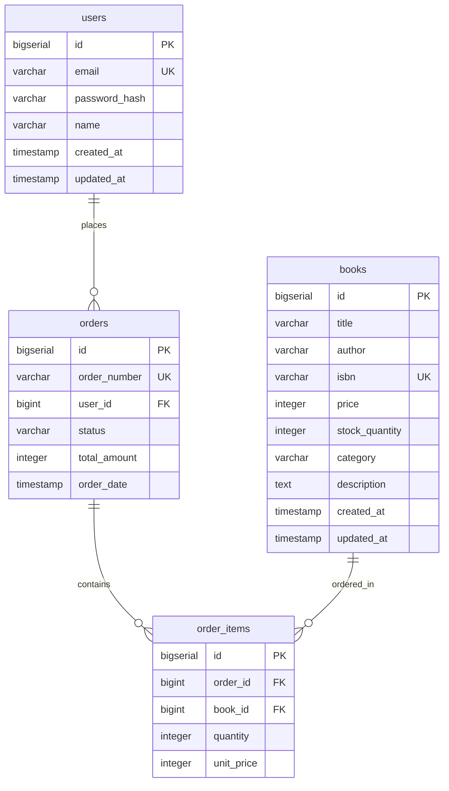

# データベース設計規約

## 概要

Readscape-JPプロジェクトにおけるPostgreSQLデータベースの設計、命名、パフォーマンス、セキュリティに関する規約を定義します。一貫性のある保守性の高いデータベース設計を目指します。

## 基本原則

1. **正規化**: 第3正規形を基本とし、パフォーマンス要件に応じて非正規化を検討
2. **一貫性**: 命名規約、データ型の統一
3. **拡張性**: 将来の機能追加・変更に対応できる設計
4. **性能**: インデックス設計によるクエリ性能の最適化
5. **セキュリティ**: アクセス制御、データ暗号化の実装

## 命名規約

### 1. テーブル名

**規則**: 複数形、スネークケース（snake_case）

```sql
-- ✅ 推奨
CREATE TABLE books (
    id BIGSERIAL PRIMARY KEY
);

CREATE TABLE user_sessions (
    id BIGSERIAL PRIMARY KEY
);

CREATE TABLE order_items (
    id BIGSERIAL PRIMARY KEY
);

-- ❌ 非推奨
CREATE TABLE Book;          -- 大文字混在
CREATE TABLE book;          -- 単数形
CREATE TABLE OrderItems;    -- キャメルケース
CREATE TABLE user-sessions; -- ハイフン使用
```

### 2. カラム名

**規則**: スネークケース、明確で簡潔な名前

```sql
-- ✅ 推奨
CREATE TABLE books (
    id BIGSERIAL PRIMARY KEY,
    title VARCHAR(200) NOT NULL,
    author VARCHAR(100) NOT NULL,
    isbn VARCHAR(13) UNIQUE NOT NULL,
    price INTEGER NOT NULL,
    publication_date DATE NOT NULL,
    created_at TIMESTAMP WITH TIME ZONE NOT NULL DEFAULT NOW(),
    updated_at TIMESTAMP WITH TIME ZONE NOT NULL DEFAULT NOW(),
    created_by BIGINT REFERENCES users(id),
    updated_by BIGINT REFERENCES users(id)
);

-- ❌ 非推奨
CREATE TABLE books (
    bookId BIGSERIAL,        -- キャメルケース
    Title VARCHAR(200),      -- 大文字開始
    pub_date DATE,          -- 略語使用
    createdDateTime TIMESTAMP -- 冗長な命名
);
```

### 3. インデックス名

**規則**: `idx_{table_name}_{column_name(s)}`

```sql
-- ✅ 推奨
CREATE INDEX idx_books_author ON books(author);
CREATE INDEX idx_books_category_status ON books(category, status);
CREATE INDEX idx_orders_user_id_created_at ON orders(user_id, created_at);

-- 複合インデックスの場合は最重要カラムを先頭に
CREATE INDEX idx_books_status_created_at ON books(status, created_at);
```

### 4. 制約名

**規則**: 
- Primary Key: `pk_{table_name}`
- Foreign Key: `fk_{table_name}_{referenced_table}`
- Unique: `uk_{table_name}_{column_name}`
- Check: `ck_{table_name}_{column_name}_{condition}`

```sql
-- ✅ 推奨
CREATE TABLE orders (
    id BIGSERIAL,
    user_id BIGINT NOT NULL,
    total_amount INTEGER NOT NULL,
    status VARCHAR(20) NOT NULL DEFAULT 'PENDING',
    
    CONSTRAINT pk_orders PRIMARY KEY (id),
    CONSTRAINT fk_orders_users FOREIGN KEY (user_id) REFERENCES users(id),
    CONSTRAINT ck_orders_total_amount_positive CHECK (total_amount > 0),
    CONSTRAINT ck_orders_status_valid CHECK (status IN ('PENDING', 'CONFIRMED', 'SHIPPED', 'DELIVERED', 'CANCELLED'))
);
```

## データ型規約

### 1. 基本データ型の使い分け

| 用途 | PostgreSQL型 | 説明 |
|------|-------------|------|
| ID（主キー） | BIGSERIAL | 自動増分、8バイト整数 |
| 外部キー | BIGINT | 主キーと同じサイズ |
| 金額 | INTEGER | 円単位、4バイト整数 |
| 数量 | INTEGER | 在庫数、注文数等 |
| 短い文字列 | VARCHAR(n) | タイトル、名前等 |
| 長い文字列 | TEXT | 説明文、コメント等 |
| 真偽値 | BOOLEAN | フラグ、状態 |
| 日付 | DATE | 出版日等 |
| 日時 | TIMESTAMP WITH TIME ZONE | 作成日時、更新日時 |
| 列挙値 | VARCHAR(20) + CHECK制約 | ステータス等 |
| JSON | JSONB | 構造化データ |

### 2. 具体例

```sql
CREATE TABLE books (
    -- 主キー（必須）
    id BIGSERIAL PRIMARY KEY,
    
    -- 基本情報
    title VARCHAR(200) NOT NULL,
    author VARCHAR(100) NOT NULL,
    isbn VARCHAR(13) UNIQUE NOT NULL,
    
    -- 数値データ
    price INTEGER NOT NULL CHECK (price > 0),
    pages INTEGER CHECK (pages > 0),
    stock_quantity INTEGER NOT NULL DEFAULT 0 CHECK (stock_quantity >= 0),
    
    -- 日付データ
    publication_date DATE NOT NULL,
    
    -- ステータス（列挙値）
    status VARCHAR(20) NOT NULL DEFAULT 'ACTIVE' 
        CHECK (status IN ('ACTIVE', 'INACTIVE', 'DELETED')),
    
    -- カテゴリ
    category VARCHAR(50) NOT NULL,
    
    -- 長いテキスト
    description TEXT,
    
    -- JSON形式のメタデータ
    metadata JSONB,
    
    -- 監査情報（必須）
    created_at TIMESTAMP WITH TIME ZONE NOT NULL DEFAULT NOW(),
    updated_at TIMESTAMP WITH TIME ZONE NOT NULL DEFAULT NOW(),
    created_by BIGINT REFERENCES users(id),
    updated_by BIGINT REFERENCES users(id)
);
```

## テーブル設計規約

### 1. 必須カラム

すべてのテーブルに以下のカラムを含める：

```sql
CREATE TABLE example_table (
    -- 主キー（必須）
    id BIGSERIAL PRIMARY KEY,
    
    -- ビジネスデータ
    -- ... 

    -- 監査情報（必須）
    created_at TIMESTAMP WITH TIME ZONE NOT NULL DEFAULT NOW(),
    updated_at TIMESTAMP WITH TIME ZONE NOT NULL DEFAULT NOW(),
    
    -- 作成者・更新者（推奨）
    created_by BIGINT REFERENCES users(id),
    updated_by BIGINT REFERENCES users(id)
);
```

### 2. 論理削除の実装

物理削除よりも論理削除を優先：

```sql
CREATE TABLE books (
    id BIGSERIAL PRIMARY KEY,
    title VARCHAR(200) NOT NULL,
    
    -- 論理削除フラグ
    is_deleted BOOLEAN NOT NULL DEFAULT false,
    deleted_at TIMESTAMP WITH TIME ZONE,
    deleted_by BIGINT REFERENCES users(id),
    
    created_at TIMESTAMP WITH TIME ZONE NOT NULL DEFAULT NOW(),
    updated_at TIMESTAMP WITH TIME ZONE NOT NULL DEFAULT NOW()
);

-- 論理削除用の部分インデックス
CREATE INDEX idx_books_active ON books(id) WHERE is_deleted = false;
```

### 3. バージョン管理（楽観的ロック）

```sql
CREATE TABLE books (
    id BIGSERIAL PRIMARY KEY,
    title VARCHAR(200) NOT NULL,
    
    -- バージョン番号（楽観的ロック用）
    version INTEGER NOT NULL DEFAULT 1,
    
    created_at TIMESTAMP WITH TIME ZONE NOT NULL DEFAULT NOW(),
    updated_at TIMESTAMP WITH TIME ZONE NOT NULL DEFAULT NOW()
);
```

## インデックス設計規約

### 1. 基本インデックス戦略

```sql
-- 主キー（自動作成）
-- Primary Key index is created automatically

-- 外部キー
CREATE INDEX idx_orders_user_id ON orders(user_id);
CREATE INDEX idx_order_items_book_id ON order_items(book_id);
CREATE INDEX idx_order_items_order_id ON order_items(order_id);

-- 検索条件によく使用されるカラム
CREATE INDEX idx_books_category ON books(category);
CREATE INDEX idx_books_author ON books(author);
CREATE INDEX idx_books_status ON books(status) WHERE status != 'DELETED';

-- 複合インデックス（検索条件の組み合わせ）
CREATE INDEX idx_books_category_status ON books(category, status);
CREATE INDEX idx_books_status_created_at ON books(status, created_at DESC);

-- テキスト検索用（全文検索）
CREATE INDEX idx_books_search ON books USING gin(to_tsvector('japanese', title || ' ' || author || ' ' || description));

-- JSON検索用
CREATE INDEX idx_books_metadata ON books USING gin(metadata);
```

### 2. パフォーマンス考慮事項

```sql
-- 部分インデックス（条件付き）
CREATE INDEX idx_orders_pending ON orders(created_at) WHERE status = 'PENDING';
CREATE INDEX idx_books_low_stock ON books(stock_quantity) WHERE stock_quantity < 10;

-- カバリングインデックス（INCLUDE使用）
CREATE INDEX idx_books_category_include 
ON books(category) INCLUDE (title, author, price, created_at);

-- 降順インデックス（新しい順での検索用）
CREATE INDEX idx_books_created_at_desc ON books(created_at DESC);
CREATE INDEX idx_orders_user_created_desc ON orders(user_id, created_at DESC);
```

## リレーションシップ設計

### 1. 外部キー制約

```sql
-- 標準的な外部キー
CREATE TABLE orders (
    id BIGSERIAL PRIMARY KEY,
    user_id BIGINT NOT NULL,
    
    CONSTRAINT fk_orders_users 
        FOREIGN KEY (user_id) REFERENCES users(id)
        ON DELETE RESTRICT  -- 参照されているユーザーは削除不可
        ON UPDATE CASCADE   -- ユーザーIDの更新は伝播
);

-- カスケード削除が適切な場合
CREATE TABLE order_items (
    id BIGSERIAL PRIMARY KEY,
    order_id BIGINT NOT NULL,
    book_id BIGINT NOT NULL,
    
    CONSTRAINT fk_order_items_orders 
        FOREIGN KEY (order_id) REFERENCES orders(id)
        ON DELETE CASCADE   -- 注文削除時にアイテムも削除
        ON UPDATE CASCADE,
        
    CONSTRAINT fk_order_items_books
        FOREIGN KEY (book_id) REFERENCES books(id)
        ON DELETE RESTRICT  -- 商品は削除不可
        ON UPDATE CASCADE
);
```

### 2. 中間テーブル設計

```sql
-- 多対多リレーション（例：書籍-タグ）
CREATE TABLE book_tags (
    id BIGSERIAL PRIMARY KEY,
    book_id BIGINT NOT NULL,
    tag_id BIGINT NOT NULL,
    
    -- 複合ユニーク制約
    CONSTRAINT uk_book_tags_book_tag UNIQUE (book_id, tag_id),
    
    -- 外部キー制約
    CONSTRAINT fk_book_tags_books FOREIGN KEY (book_id) REFERENCES books(id) ON DELETE CASCADE,
    CONSTRAINT fk_book_tags_tags FOREIGN KEY (tag_id) REFERENCES tags(id) ON DELETE CASCADE,
    
    -- 監査情報
    created_at TIMESTAMP WITH TIME ZONE NOT NULL DEFAULT NOW(),
    created_by BIGINT REFERENCES users(id)
);

-- 効率的な検索用インデックス
CREATE INDEX idx_book_tags_book_id ON book_tags(book_id);
CREATE INDEX idx_book_tags_tag_id ON book_tags(tag_id);
```

## セキュリティ設計

### 1. 行レベルセキュリティ（RLS）

```sql
-- Row Level Security の有効化
ALTER TABLE orders ENABLE ROW LEVEL SECURITY;

-- ポリシー定義（ユーザーは自分の注文のみ閲覧可能）
CREATE POLICY orders_user_policy ON orders
    FOR ALL
    TO application_user
    USING (user_id = current_setting('app.current_user_id')::BIGINT);

-- 管理者は全件アクセス可能
CREATE POLICY orders_admin_policy ON orders
    FOR ALL
    TO admin_user
    USING (true);
```

### 2. 機密データの暗号化

```sql
-- 機密データカラムの暗号化
CREATE EXTENSION IF NOT EXISTS pgcrypto;

CREATE TABLE user_payment_methods (
    id BIGSERIAL PRIMARY KEY,
    user_id BIGINT NOT NULL REFERENCES users(id),
    
    -- 暗号化された支払い情報
    encrypted_card_number TEXT NOT NULL, -- pgp_sym_encrypt で暗号化
    card_holder_name VARCHAR(100) NOT NULL,
    
    -- ハッシュ化された検索用
    card_number_hash VARCHAR(64) NOT NULL, -- SHA-256ハッシュ
    
    created_at TIMESTAMP WITH TIME ZONE NOT NULL DEFAULT NOW(),
    
    -- 検索用インデックス（ハッシュ値）
    CONSTRAINT uk_payment_methods_card_hash UNIQUE (card_number_hash)
);
```

## データ整合性規約

### 1. CHECK制約

```sql
CREATE TABLE books (
    id BIGSERIAL PRIMARY KEY,
    title VARCHAR(200) NOT NULL,
    price INTEGER NOT NULL,
    stock_quantity INTEGER NOT NULL DEFAULT 0,
    rating NUMERIC(3,2),
    status VARCHAR(20) NOT NULL DEFAULT 'ACTIVE',
    
    -- CHECK制約による整合性確保
    CONSTRAINT ck_books_price_positive CHECK (price > 0),
    CONSTRAINT ck_books_stock_non_negative CHECK (stock_quantity >= 0),
    CONSTRAINT ck_books_rating_range CHECK (rating >= 1.0 AND rating <= 5.0),
    CONSTRAINT ck_books_status_valid CHECK (status IN ('ACTIVE', 'INACTIVE', 'DELETED')),
    CONSTRAINT ck_books_title_not_empty CHECK (LENGTH(TRIM(title)) > 0)
);
```

### 2. トリガーによる整合性確保

```sql
-- 更新日時自動更新トリガー
CREATE OR REPLACE FUNCTION update_updated_at_column()
RETURNS TRIGGER AS $$
BEGIN
    NEW.updated_at = NOW();
    RETURN NEW;
END;
$$ language 'plpgsql';

-- トリガーの適用
CREATE TRIGGER update_books_updated_at 
    BEFORE UPDATE ON books 
    FOR EACH ROW 
    EXECUTE FUNCTION update_updated_at_column();

-- 在庫減少トリガー（注文確定時）
CREATE OR REPLACE FUNCTION update_book_stock()
RETURNS TRIGGER AS $$
BEGIN
    IF TG_OP = 'INSERT' THEN
        UPDATE books 
        SET stock_quantity = stock_quantity - NEW.quantity
        WHERE id = NEW.book_id;
        
        -- 在庫不足チェック
        IF (SELECT stock_quantity FROM books WHERE id = NEW.book_id) < 0 THEN
            RAISE EXCEPTION '在庫が不足しています。Book ID: %', NEW.book_id;
        END IF;
        
        RETURN NEW;
    END IF;
    
    RETURN NULL;
END;
$$ LANGUAGE plpgsql;

CREATE TRIGGER trigger_update_book_stock
    AFTER INSERT ON order_items
    FOR EACH ROW
    EXECUTE FUNCTION update_book_stock();
```

## パフォーマンス最適化

### 1. パーティショニング

```sql
-- 大きなテーブルの日付によるパーティショニング
CREATE TABLE order_history (
    id BIGSERIAL,
    user_id BIGINT NOT NULL,
    total_amount INTEGER NOT NULL,
    order_date DATE NOT NULL,
    created_at TIMESTAMP WITH TIME ZONE NOT NULL DEFAULT NOW()
) PARTITION BY RANGE (order_date);

-- 年ごとのパーティション
CREATE TABLE order_history_2024 PARTITION OF order_history
    FOR VALUES FROM ('2024-01-01') TO ('2025-01-01');

CREATE TABLE order_history_2025 PARTITION OF order_history
    FOR VALUES FROM ('2025-01-01') TO ('2026-01-01');

-- パーティション別インデックス
CREATE INDEX idx_order_history_2024_user_id ON order_history_2024(user_id);
CREATE INDEX idx_order_history_2025_user_id ON order_history_2025(user_id);
```

### 2. マテリアライズドビュー

```sql
-- 集計データのマテリアライズドビュー
CREATE MATERIALIZED VIEW book_statistics AS
SELECT 
    b.id,
    b.title,
    b.category,
    COUNT(r.id) as review_count,
    AVG(r.rating) as average_rating,
    COUNT(oi.id) as total_sales,
    SUM(oi.quantity) as total_quantity_sold
FROM books b
LEFT JOIN reviews r ON b.id = r.book_id
LEFT JOIN order_items oi ON b.id = oi.book_id
LEFT JOIN orders o ON oi.order_id = o.id AND o.status = 'DELIVERED'
WHERE b.is_deleted = false
GROUP BY b.id, b.title, b.category;

-- インデックス作成
CREATE INDEX idx_book_statistics_category ON book_statistics(category);
CREATE INDEX idx_book_statistics_rating ON book_statistics(average_rating DESC);

-- 定期的な更新（cron等で実行）
-- REFRESH MATERIALIZED VIEW CONCURRENTLY book_statistics;
```

### 3. クエリ最適化のガイドライン

```sql
-- ✅ 推奨：インデックスを活用したクエリ
SELECT * FROM books 
WHERE category = '技術書' AND status = 'ACTIVE'
ORDER BY created_at DESC
LIMIT 20;

-- ✅ 推奨：適切なJOIN
SELECT b.title, u.name, r.rating
FROM books b
JOIN reviews r ON b.id = r.book_id
JOIN users u ON r.user_id = u.id
WHERE b.category = '技術書'
  AND r.rating >= 4;

-- ❌ 非推奨：関数を使ったWHERE句
SELECT * FROM books WHERE UPPER(title) = 'JAVA入門'; -- インデックスが使えない

-- ✅ 推奨：関数インデックスを使用
CREATE INDEX idx_books_title_upper ON books(UPPER(title));
-- 上記インデックス作成後は関数での検索も最適化される
```

## Flyway マイグレーション規約

### 1. ファイル命名規則

```
V{version}__{description}.sql
```

例:
- `V0001__create_users_table.sql`
- `V0002__create_books_table.sql`
- `V0003__add_book_category_index.sql`
- `V0004__alter_books_add_metadata.sql`

### 2. マイグレーションファイルの構造

```sql
-- V0001__create_users_table.sql

-- ===========================================
-- Migration: Create users table
-- Version: V0001
-- Description: ユーザー管理テーブルの作成
-- Author: Development Team
-- Date: 2024-01-15
-- ===========================================

-- users テーブル作成
CREATE TABLE users (
    id BIGSERIAL PRIMARY KEY,
    email VARCHAR(255) UNIQUE NOT NULL,
    password_hash VARCHAR(255) NOT NULL,
    name VARCHAR(100) NOT NULL,
    
    -- 監査カラム
    created_at TIMESTAMP WITH TIME ZONE NOT NULL DEFAULT NOW(),
    updated_at TIMESTAMP WITH TIME ZONE NOT NULL DEFAULT NOW(),
    
    -- 制約
    CONSTRAINT ck_users_email_format CHECK (email ~* '^[A-Za-z0-9._%+-]+@[A-Za-z0-9.-]+\.[A-Za-z]{2,}$'),
    CONSTRAINT ck_users_name_not_empty CHECK (LENGTH(TRIM(name)) > 0)
);

-- インデックス作成
CREATE INDEX idx_users_email ON users(email);
CREATE INDEX idx_users_created_at ON users(created_at DESC);

-- コメント追加
COMMENT ON TABLE users IS 'ユーザー情報テーブル';
COMMENT ON COLUMN users.id IS 'ユーザーID（主キー）';
COMMENT ON COLUMN users.email IS 'メールアドレス（ログインID）';
COMMENT ON COLUMN users.password_hash IS 'ハッシュ化されたパスワード';
COMMENT ON COLUMN users.name IS 'ユーザー名';

-- 初期データ（必要に応じて）
-- INSERT INTO users (email, password_hash, name) 
-- VALUES ('admin@readscape.jp', '$2a$10$...', '管理者');
```

### 3. ロールバック対応

```sql
-- 削除やデータ変更を伴う場合は、ロールバック用コマンドをコメントで記載
-- V0005__remove_obsolete_column.sql

-- ロールバック用SQL（緊急時のみ手動実行）
-- ALTER TABLE books ADD COLUMN old_column VARCHAR(50);

-- メインのマイグレーション
ALTER TABLE books DROP COLUMN IF EXISTS old_column;
```

## データベースドキュメント規約

### 1. テーブル定義書

```sql
-- テーブルとカラムにコメントを必須で追加
COMMENT ON TABLE books IS '書籍マスタテーブル - 販売する書籍の基本情報を管理';
COMMENT ON COLUMN books.id IS '書籍ID（主キー、自動採番）';
COMMENT ON COLUMN books.title IS '書籍タイトル（最大200文字）';
COMMENT ON COLUMN books.isbn IS 'ISBN-13（国際標準図書番号）';
COMMENT ON COLUMN books.price IS '販売価格（税込み、円単位）';
COMMENT ON COLUMN books.stock_quantity IS '在庫数量（負の値は不可）';
```

### 2. ER図の維持



この規約に従うことで、保守性が高く拡張可能なデータベース設計を実現できます。