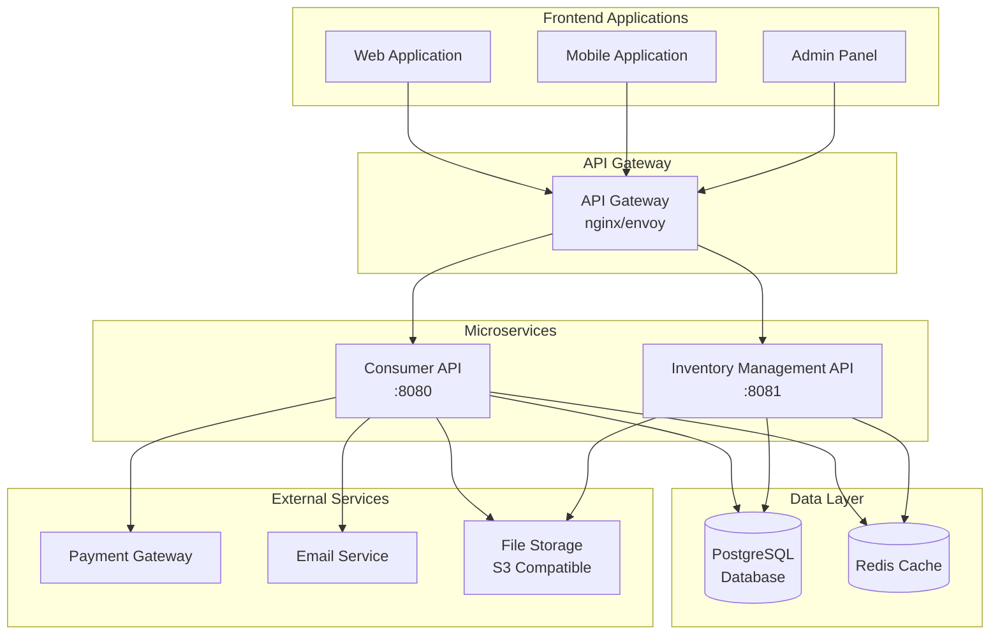
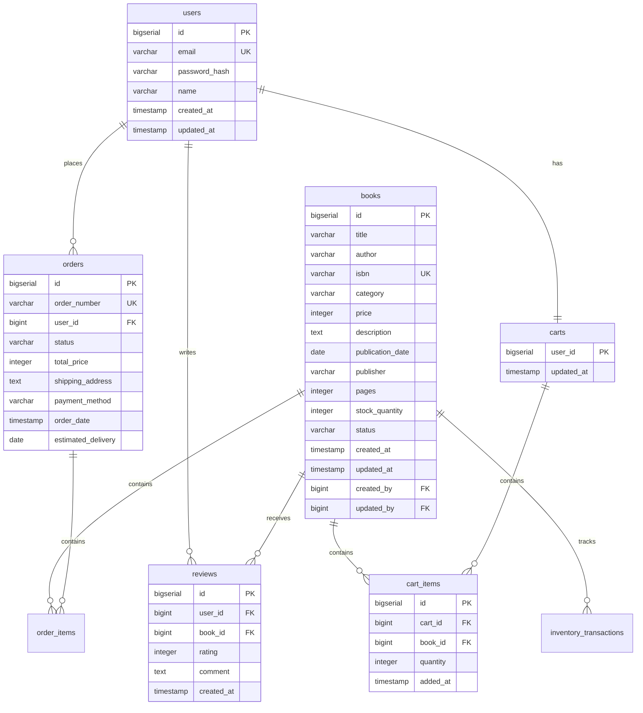
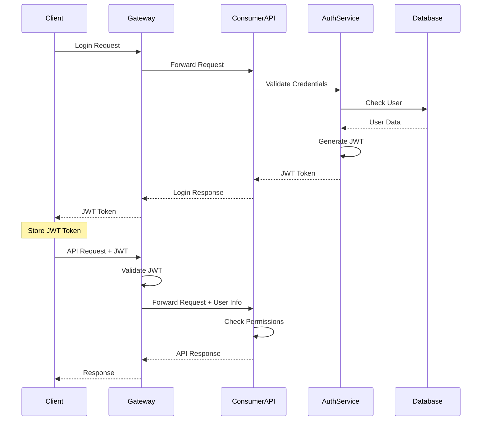
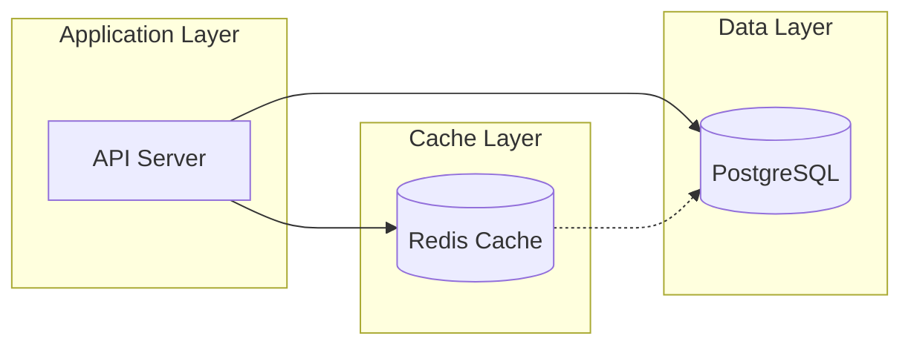
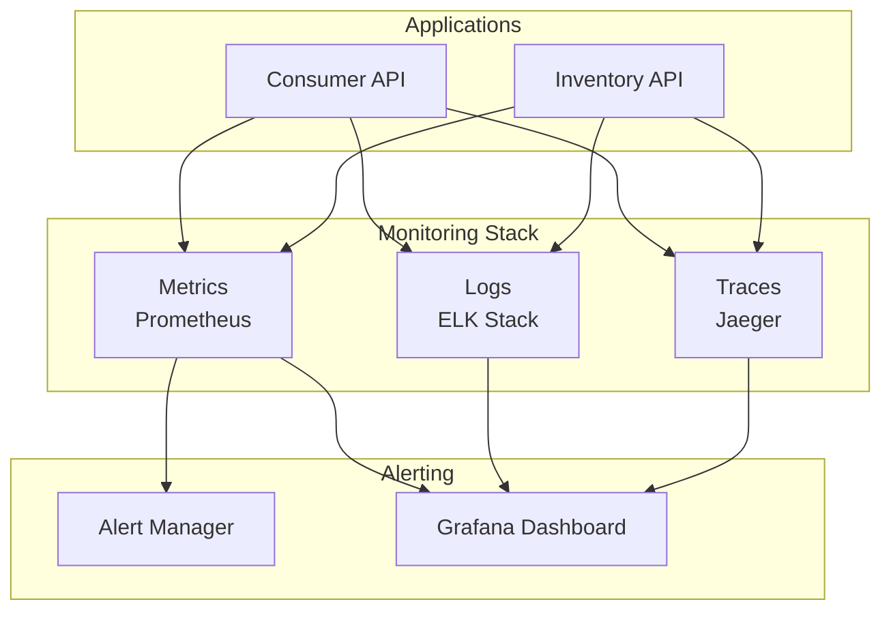

# システムアーキテクチャ設計書

## 概要

Readscape-JPは、書籍販売システムとして、一般消費者向けのConsumer APIと管理者向けのInventory Management APIを提供するマイクロサービスアーキテクチャを採用しています。

## 全体システム構成

## マイクロサービス分離戦略

### 1. Consumer API（消費者向けAPI）

#### 責務
- 書籍検索・閲覧機能
- ユーザー登録・認証
- ショッピングカート管理
- 注文処理
- レビュー投稿・閲覧

#### 技術スタック
- **フレームワーク**: Spring Boot 3.2.0
- **Java バージョン**: Java 21
- **認証**: JWT + Spring Security
- **データアクセス**: Spring Data JPA
- **API文書**: Springdoc OpenAPI

#### 特徴
- 読み取り中心のワークロード
- 高い同時アクセス要求
- 外部システム連携（決済、メール）

### 2. Inventory Management API（在庫管理API）

#### 責務
- 書籍マスタ管理（CRUD）
- 在庫管理・追跡
- 管理者認証・認可
- 売上分析・レポート
- システム管理機能

#### 技術スタック
- **フレームワーク**: Spring Boot 3.2.0
- **Java バージョン**: Java 21
- **認証**: JWT + Spring Security（ロールベース）
- **データアクセス**: Spring Data JPA
- **API文書**: Springdoc OpenAPI

#### 特徴
- 書き込み中心のワークロード
- 管理者権限での操作
- データ整合性の重視
- バッチ処理機能

## データベース構成

### 共有データベース戦略

両APIは同一のPostgreSQLデータベースを共有しますが、論理的にスキーマを分離しています。

### データ一貫性の確保

1. **Transaction Management**
   - Spring の `@Transactional` アノテーションによる宣言的トランザクション
   - データベースレベルでの外部キー制約
   - 楽観的ロック（`@Version`）による同時実行制御

2. **Data Validation**
   - Bean Validation（JSR-303）による入力検証
   - データベース制約による整合性チェック
   - ビジネスロジック層での整合性確認

## セキュリティアーキテクチャ

### 認証・認可フロー

### セキュリティ層

1. **Network Security**
   - HTTPS通信の強制
   - CORS設定による適切なオリジン制御
   - Rate Limiting（レート制限）

2. **Application Security**
   - JWT による認証
   - ロールベースアクセス制御（RBAC）
   - Input Validation & Sanitization
   - SQL Injection対策（JPA使用）

3. **Data Security**
   - パスワードのハッシュ化（bcrypt）
   - 個人情報の暗号化
   - 監査ログの記録

## キャッシュ戦略

### Redis キャッシュ活用

#### キャッシュ対象データ
- **書籍情報**: 検索結果、カテゴリー一覧
- **ユーザーセッション**: JWT トークンブラックリスト
- **システム設定**: アプリケーション設定値

#### キャッシュ戦略
- **TTL設定**: データ特性に応じた有効期限
- **Cache-Aside Pattern**: アプリケーション制御によるキャッシュ
- **Write-Behind**: 非同期書き込みによる性能向上

## パフォーマンス設計

### 目標性能指標

| メトリクス | 目標値 | 測定方法 |
|-----------|--------|----------|
| API レスポンス時間 | < 200ms | APM ツール |
| データベースクエリ時間 | < 100ms | JPA Statistics |
| アプリケーション起動時間 | < 30秒 | 起動ログ |
| 同時接続数 | 1,000+ | Load Testing |
| スループット | 100 req/sec | Benchmark |

### 性能最適化戦略

1. **データベース最適化**
   - インデックス設計による検索性能向上
   - クエリチューニング
   - Connection Pooling

2. **アプリケーション最適化**
   - レスポンシブキャッシング
   - 非同期処理の活用
   - リソースプールの最適化

3. **インフラ最適化**
   - ロードバランシング
   - オートスケーリング
   - CDN活用（静的リソース）

## 監視・運用設計

### Observability（可観測性）

#### 監視項目
- **インフラメトリクス**: CPU、メモリ、ディスク使用率
- **アプリケーションメトリクス**: レスポンス時間、エラー率
- **ビジネスメトリクス**: 注文数、売上額、ユーザー数

## 拡張性・可用性設計

### スケーラビリティ

1. **水平スケーリング**
   - ステートレス設計による複数インスタンス対応
   - ロードバランサーによる負荷分散
   - データベース読み取りレプリカ

2. **垂直スケーリング**
   - JVM チューニング
   - リソース制限の動的調整

### 可用性（High Availability）

1. **冗長化**
   - アプリケーションサーバーの複数配置
   - データベースクラスタリング
   - Redis Sentinel/Cluster

2. **障害対策**
   - Health Check エンドポイント
   - Circuit Breaker パターン
   - Graceful Shutdown

## 今後の拡張計画

### Phase 2: マイクロサービス分離
- User Service の独立
- Order Service の独立
- Search Service の独立

### Phase 3: イベント駆動アーキテクチャ
- メッセージブローカー導入（Apache Kafka/RabbitMQ）
- 非同期イベント処理
- CQRS パターン適用

### Phase 4: クラウドネイティブ化
- Kubernetes デプロイメント
- Service Mesh（Istio）導入
- Serverless Function の活用