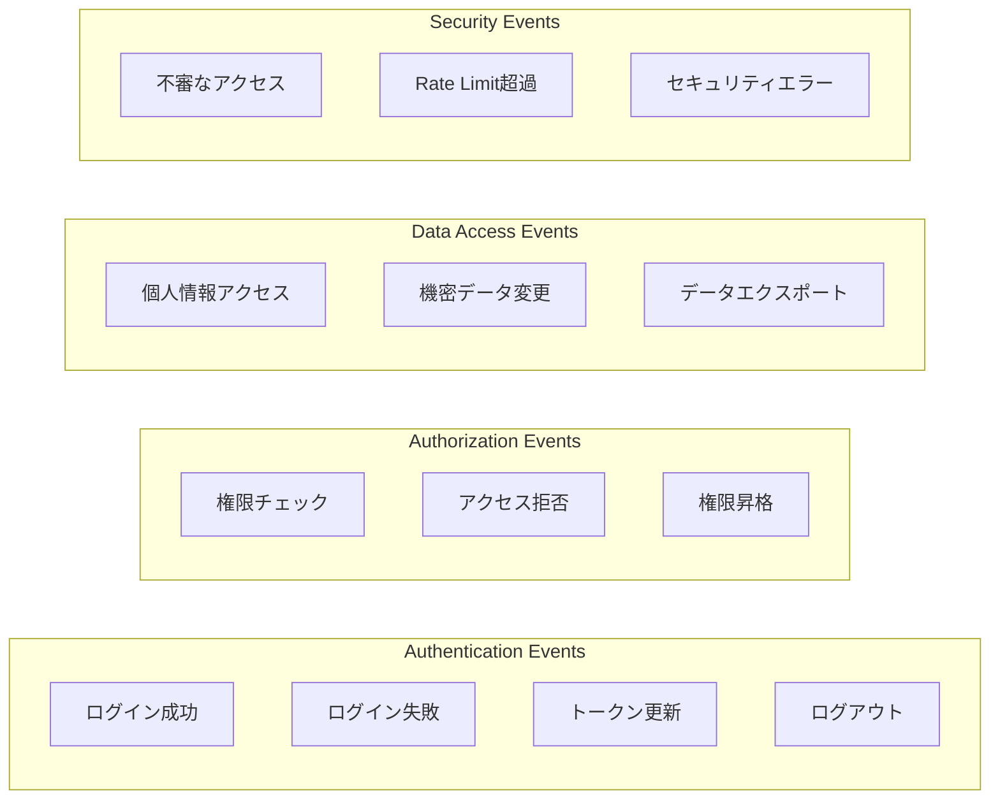

# セキュリティアーキテクチャ設計書

## 概要

Readscape-JPにおけるセキュリティ設計は、データ保護、アクセス制御、脅威対策を多層防御で実現します。金融グレードのセキュリティレベルを目標とし、個人情報保護法（PIPEDA）やGDPRなどの規制要件にも対応します。

## セキュリティ原則

### 1. Defense in Depth（多層防御）
- ネットワーク層、アプリケーション層、データ層での多重セキュリティ
- 単一障害点を排除した設計
- 継続的な監視とインシデント対応

### 2. Principle of Least Privilege（最小権限の原則）
- ユーザーには必要最小限の権限のみ付与
- ロールベースアクセス制御（RBAC）の徹底
- 時限付きアクセス権限の活用

### 3. Zero Trust Architecture
- 内部ネットワークも信頼しない前提
- 全通信の暗号化と認証
- 継続的な検証と監視

## 認証・認可アーキテクチャ

### JWT認証フロー


### JWT セキュリティ設定

#### トークン構成
```json
{
  "header": {
    "alg": "RS256",
    "typ": "JWT"
  },
  "payload": {
    "sub": "user123",
    "iat": 1640995200,
    "exp": 1640998800,
    "iss": "readscape-jp",
    "aud": ["consumer-api", "inventory-api"],
    "roles": ["USER", "PREMIUM"],
    "permissions": ["book:read", "cart:write"]
  }
}
```

#### セキュリティ要件
- **アルゴリズム**: RS256（RSA署名）
- **キーサイズ**: 2048bit以上
- **有効期限**: 15分（アクセストークン）、30日（リフレッシュトークン）
- **発行者検証**: iss クレームによる発行者確認
- **対象者検証**: aud クレームによる対象API確認

### ロールベースアクセス制御（RBAC）

#### 権限モデル


#### Permission Matrix

| リソース | GUEST | USER | PREMIUM | MANAGER | ADMIN |
|----------|-------|------|---------|---------|-------|
| books:read | ✓ | ✓ | ✓ | ✓ | ✓ |
| books:write | ✗ | ✗ | ✗ | ✗ | ✓ |
| cart:read | ✗ | ✓ | ✓ | ✗ | ✗ |
| cart:write | ✗ | ✓ | ✓ | ✗ | ✗ |
| orders:read | ✗ | ✓(own) | ✓(own) | ✓(all) | ✓(all) |
| orders:write | ✗ | ✓ | ✓ | ✗ | ✗ |
| inventory:read | ✗ | ✗ | ✗ | ✓ | ✓ |
| inventory:write | ✗ | ✗ | ✗ | ✗ | ✓ |
| users:admin | ✗ | ✗ | ✗ | ✗ | ✓ |

## データ保護

### 暗号化戦略

#### 1. Transport Layer Security（TLS）

**設定要件**
- TLS 1.3 以上を使用
- Forward Secrecy対応の暗号スイート
- HSTS（HTTP Strict Transport Security）有効化
- 証明書の自動更新（Let's Encrypt/ACME）

**実装例**
```yaml
server:
  ssl:
    enabled: true
    key-store: classpath:keystore/server.p12
    key-store-password: ${SSL_KEYSTORE_PASSWORD}
    key-store-type: PKCS12
    protocol: TLS
    enabled-protocols: TLSv1.3
```

#### 2. Data at Rest Encryption

**データベース暗号化**
```sql
-- 個人情報テーブルの暗号化
CREATE TABLE users (
    id BIGSERIAL PRIMARY KEY,
    email VARCHAR(255) NOT NULL,
    email_hash VARCHAR(64) UNIQUE NOT NULL, -- 検索用ハッシュ
    password_hash VARCHAR(255) NOT NULL,
    name_encrypted BYTEA, -- AES-256暗号化
    created_at TIMESTAMP DEFAULT NOW()
);
```

**アプリケーション層での暗号化**
```java
@Entity
public class User {
    @Convert(converter = EncryptedStringConverter.class)
    @Column(name = "name_encrypted")
    private String name;
    
    @Convert(converter = EncryptedStringConverter.class)
    @Column(name = "address_encrypted") 
    private String address;
}

@Converter
public class EncryptedStringConverter implements AttributeConverter<String, String> {
    
    @Override
    public String convertToDatabaseColumn(String attribute) {
        return encryptionService.encrypt(attribute);
    }
    
    @Override
    public String convertToEntityAttribute(String dbData) {
        return encryptionService.decrypt(dbData);
    }
}
```

#### 3. パスワードセキュリティ

**ハッシュ化仕様**
- アルゴリズム: bcrypt
- ソルトラウンド: 12以上
- ペッパーソルト併用

```java
@Service
public class PasswordService {
    
    private static final int SALT_ROUNDS = 12;
    
    public String hashPassword(String plainPassword) {
        return BCrypt.hashpw(plainPassword + pepper, BCrypt.gensalt(SALT_ROUNDS));
    }
    
    public boolean verifyPassword(String plainPassword, String hashedPassword) {
        return BCrypt.checkpw(plainPassword + pepper, hashedPassword);
    }
}
```

### 個人情報保護

#### データ最小化
- 必要最小限の個人情報のみ収集
- 目的外使用の禁止
- 保存期間の制限

#### 匿名化・仮名化
```java
@Entity
public class AnalyticsData {
    private String userIdHash;  // ユーザーIDのハッシュ値
    private String sessionId;   // セッション識別子
    private LocalDateTime timestamp;
    private String action;
    
    // 個人を特定できない形で分析データを保存
}
```

## 脅威対策

### 1. SQL Injection 対策

**JPA使用による対策**
```java
// 安全な実装例
@Repository
public class BookRepository {
    
    @Query("SELECT b FROM Book b WHERE b.title LIKE %:keyword% OR b.author LIKE %:keyword%")
    List<Book> searchBooks(@Param("keyword") String keyword);
    
    // ✗ 危険な実装（使用禁止）
    // @Query(value = "SELECT * FROM books WHERE title = '" + keyword + "'", nativeQuery = true)
}
```

### 2. Cross-Site Scripting（XSS）対策

**入力検証とサニタイゼーション**
```java
@RestController
public class BookController {
    
    @PostMapping("/reviews")
    public ResponseEntity<Review> createReview(@Valid @RequestBody CreateReviewRequest request) {
        // Bean Validationによる入力検証
        String sanitizedComment = htmlSanitizer.sanitize(request.getComment());
        
        Review review = reviewService.createReview(request.getBookId(), sanitizedComment);
        return ResponseEntity.ok(review);
    }
}

@Component
public class HtmlSanitizer {
    
    private final PolicyFactory policy = Sanitizers.FORMATTING
        .and(Sanitizers.LINKS)
        .and(Sanitizers.BLOCKS);
    
    public String sanitize(String input) {
        return policy.sanitize(input);
    }
}
```

### 3. Cross-Site Request Forgery（CSRF）対策

**Spring Security CSRF設定**
```java
@Configuration
@EnableWebSecurity
public class SecurityConfig {
    
    @Bean
    public SecurityFilterChain filterChain(HttpSecurity http) throws Exception {
        return http
            .csrf(csrf -> csrf
                .csrfTokenRepository(CookieCsrfTokenRepository.withHttpOnlyFalse())
                .ignoringRequestMatchers("/api/auth/login")) // JWT認証のため除外
            .sessionManagement(session -> 
                session.sessionCreationPolicy(SessionCreationPolicy.STATELESS))
            .build();
    }
}
```

### 4. Rate Limiting

**API Rate Limiting実装**
```java
@Component
public class RateLimitingFilter implements Filter {
    
    private final RateLimiter rateLimiter = RateLimiter.create(100.0); // 100 req/sec
    
    @Override
    public void doFilter(ServletRequest request, ServletResponse response, 
                        FilterChain chain) throws IOException, ServletException {
        
        if (!rateLimiter.tryAcquire()) {
            HttpServletResponse httpResponse = (HttpServletResponse) response;
            httpResponse.setStatus(HttpStatus.TOO_MANY_REQUESTS.value());
            httpResponse.getWriter().write("Rate limit exceeded");
            return;
        }
        
        chain.doFilter(request, response);
    }
}
```

### 5. 入力検証

**Bean Validation設定**
```java
@Data
@Validated
public class CreateBookRequest {
    
    @NotBlank(message = "タイトルは必須です")
    @Size(max = 200, message = "タイトルは200文字以内で入力してください")
    private String title;
    
    @NotBlank(message = "著者名は必須です")
    @Size(max = 100, message = "著者名は100文字以内で入力してください")
    private String author;
    
    @Pattern(regexp = "^97[8-9][0-9]{10}$", message = "有効なISBNを入力してください")
    private String isbn;
    
    @Min(value = 1, message = "価格は1円以上で入力してください")
    @Max(value = 999999, message = "価格は999,999円以下で入力してください")
    private Integer price;
    
    @Size(max = 2000, message = "説明は2000文字以内で入力してください")
    private String description;
}
```

## セキュリティ監査ログ

### 監査対象イベント



### ログ形式仕様

```json
{
  "timestamp": "2024-01-15T10:30:00.123Z",
  "level": "INFO",
  "event_type": "AUTHENTICATION",
  "event_name": "LOGIN_SUCCESS",
  "user_id": "user123",
  "session_id": "sess_456",
  "ip_address": "192.168.1.100",
  "user_agent": "Mozilla/5.0...",
  "resource": "/api/auth/login",
  "method": "POST",
  "status_code": 200,
  "details": {
    "roles": ["USER"],
    "login_method": "password"
  },
  "risk_score": 1
}
```

## セキュリティテスト

### 1. 静的セキュリティテスト

**SpotBugs Security Plugin**
```gradle
plugins {
    id 'com.github.spotbugs' version '5.0.14'
}

spotbugs {
    includeFilter = file('config/spotbugs/security-include.xml')
    excludeFilter = file('config/spotbugs/security-exclude.xml')
}
```

**SonarQube Security Rules**
```yaml
# sonar-project.properties
sonar.security.hotspots.enabled=true
sonar.security.review.enabled=true
sonar.java.checkstyle.reportPaths=build/reports/checkstyle/main.xml
```

### 2. 動的セキュリティテスト

**OWASP ZAP Integration**
```java
@SpringBootTest(webEnvironment = SpringBootTest.WebEnvironment.RANDOM_PORT)
class SecurityIntegrationTest {
    
    @Test
    void zapSecurityScan() {
        // OWASP ZAP による自動セキュリティスキャン
        ClientApi zapClient = new ClientApi("localhost", 8090);
        
        // Spider scan
        zapClient.spider.scan(baseUrl, null, null, null, null);
        
        // Active scan
        zapClient.ascan.scan(baseUrl, null, null, null, null, null);
        
        // Results analysis
        List<Alert> alerts = zapClient.core.alerts(baseUrl, null, null);
        alerts.stream()
            .filter(alert -> alert.getRisk().equals("High"))
            .forEach(alert -> fail("High risk security issue: " + alert.getAlert()));
    }
}
```

### 3. ペネトレーションテスト

**テスト項目**
- SQLインジェクション検証
- XSS攻撃耐性確認
- 認証バイパス検証
- 権限昇格テスト
- セッション管理テスト

## インシデント対応

### セキュリティインシデント分類

| レベル | 定義 | 対応時間 | 対応チーム |
|--------|------|----------|------------|
| Critical | データ漏洩、システム侵害 | 1時間以内 | 全チーム |
| High | 認証システム障害、DoS攻撃 | 4時間以内 | セキュリティ + 開発 |
| Medium | 権限エラー、不審なアクセス | 24時間以内 | セキュリティチーム |
| Low | ログ異常、設定ミス | 72時間以内 | 開発チーム |

### インシデント対応フロー


## セキュリティ運用

### 継続的セキュリティ監視

**監視項目**
- 異常なAPI呼び出しパターン
- 複数回のログイン失敗
- 権限外リソースへのアクセス試行
- 大量データアクセス
- 時間外アクセス

**自動化ツール**
- SIEM（Security Information and Event Management）
- IDS/IPS（侵入検知・防止システム）
- ログ分析ツール（ELK Stack）

### セキュリティアップデート管理

**脆弱性管理プロセス**
1. 依存関係の定期スキャン（Dependabot）
2. CVE（Common Vulnerabilities and Exposures）監視
3. セキュリティパッチの優先適用
4. 影響範囲の評価とテスト
5. 緊急デプロイメント

## コンプライアンス

### 準拠規格・法令

- **個人情報保護法（日本）**
- **GDPR（欧州一般データ保護規則）**
- **PCI DSS（決済業界セキュリティ基準）**
- **ISO 27001（情報セキュリティ管理）**

### プライバシーバイデザイン

1. **Proactive not Reactive**: 事前の脅威対策
2. **Privacy as the Default**: デフォルトでプライバシー保護
3. **Data Minimization**: 必要最小限のデータ収集
4. **Transparency**: 透明性の確保
5. **User Control**: ユーザーのデータ制御権

## まとめ

Readscape-JPのセキュリティアーキテクチャは、現代的な脅威に対応する多層防御を実現しています：

1. **強固な認証基盤**: JWT + Spring Securityによる包括的認証
2. **細密な認可制御**: RBACによる最小権限アクセス
3. **データ保護**: 暗号化と匿名化による情報保護
4. **脅威対策**: OWASP Top 10対応の包括的対策
5. **継続的監視**: 自動化されたセキュリティ監視
6. **インシデント対応**: 迅速かつ体系的な対応プロセス

セキュリティは継続的なプロセスであり、新たな脅威や規制要件に対応するため、定期的な見直しと改善を行います。