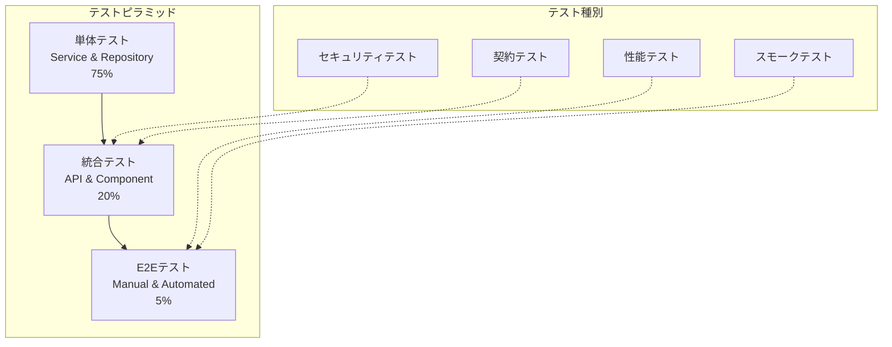

# Readscape-JP テスト戦略・実装ガイド

## 概要

Readscape-JPプロジェクトにおける包括的なテスト戦略です。品質保証、継続的インテグレーション、デプロイメント安全性を確保するため、各層でのテスト手法とベストプラクティスを定義します。

## テストピラミッド



## 単体テスト戦略

### 1. テスト構成

#### テストクラス構造

```java
// BookServiceTest.java
@ExtendWith(MockitoExtension.class)
@DisplayName("BookService - 書籍サービステスト")
class BookServiceTest {
    
    @Mock
    private BookRepository bookRepository;
    
    @Mock
    private BookMapper bookMapper;
    
    @Mock
    private AuditLogger auditLogger;
    
    @InjectMocks
    private BookServiceImpl bookService;
    
    @Nested
    @DisplayName("findBookById - ID指定書籍取得")
    class FindBookByIdTest {
        
        @Test
        @DisplayName("有効なIDで書籍が取得できる")
        void findBookById_WithValidId_ReturnsBook() {
            // Given
            Long bookId = 1L;
            Book expectedBook = createTestBook(bookId, "Test Book", "Test Author");
            
            when(bookRepository.findByIdAndIsDeletedFalse(bookId))
                .thenReturn(Optional.of(expectedBook));
            
            // When
            Book actualBook = bookService.findBookById(bookId);
            
            // Then
            assertThat(actualBook)
                .isNotNull()
                .satisfies(book -> {
                    assertThat(book.getId()).isEqualTo(bookId);
                    assertThat(book.getTitle()).isEqualTo("Test Book");
                    assertThat(book.getAuthor()).isEqualTo("Test Author");
                });
                
            verify(bookRepository).findByIdAndIsDeletedFalse(bookId);
        }
        
        @Test
        @DisplayName("存在しないIDの場合、BookNotFoundExceptionが発生する")
        void findBookById_WithNonExistentId_ThrowsBookNotFoundException() {
            // Given
            Long nonExistentId = 999L;
            when(bookRepository.findByIdAndIsDeletedFalse(nonExistentId))
                .thenReturn(Optional.empty());
            
            // When & Then
            assertThatThrownBy(() -> bookService.findBookById(nonExistentId))
                .isInstanceOf(BookNotFoundException.class)
                .hasMessage("Book not found: " + nonExistentId);
        }
        
        @ParameterizedTest
        @DisplayName("無効なIDの場合、IllegalArgumentExceptionが発生する")
        @ValueSource(longs = {0L, -1L, -100L})
        void findBookById_WithInvalidId_ThrowsIllegalArgumentException(Long invalidId) {
            // When & Then
            assertThatThrownBy(() -> bookService.findBookById(invalidId))
                .isInstanceOf(IllegalArgumentException.class)
                .hasMessage("Book ID must be positive: " + invalidId);
        }
    }
    
    @Nested
    @DisplayName("createBook - 書籍新規作成")
    class CreateBookTest {
        
        @Test
        @DisplayName("有効なリクエストで書籍が作成できる")
        void createBook_WithValidRequest_ReturnsCreatedBook() {
            // Given
            CreateBookRequest request = CreateBookRequest.builder()
                .title("Spring Boot入門")
                .author("山田太郎")
                .isbn("9784000000001")
                .price(3200)
                .category("技術書")
                .description("Spring Bootの基礎から応用まで")
                .publicationDate(LocalDate.of(2024, 1, 15))
                .publisher("技術出版社")
                .pages(450)
                .initialStock(100)
                .build();
                
            Book entityToSave = createTestBookFromRequest(request);
            Book savedBook = createTestBookFromRequest(request);
            savedBook.setId(1L);
            savedBook.setCreatedAt(LocalDateTime.now());
            
            when(bookMapper.toEntity(request)).thenReturn(entityToSave);
            when(bookRepository.save(entityToSave)).thenReturn(savedBook);
            
            // When
            Book result = bookService.createBook(request);
            
            // Then
            assertThat(result).isNotNull();
            assertThat(result.getId()).isEqualTo(1L);
            assertThat(result.getTitle()).isEqualTo(request.getTitle());
            
            verify(bookRepository).save(entityToSave);
            verify(auditLogger).logUserAction(
                eq("CREATE_BOOK"),
                any(),
                eq("books"),
                any()
            );
        }
    }
    
    // テストデータ作成ヘルパー
    private Book createTestBook(Long id, String title, String author) {
        return Book.builder()
            .id(id)
            .title(title)
            .author(author)
            .isbn("9784000000001")
            .price(3200)
            .category("技術書")
            .status(BookStatus.ACTIVE)
            .stockQuantity(100)
            .isDeleted(false)
            .createdAt(LocalDateTime.now())
            .updatedAt(LocalDateTime.now())
            .build();
    }
}
```

### 2. テストカバレッジ設定

```gradle
// build.gradle
apply plugin: 'jacoco'

jacoco {
    toolVersion = "0.8.8"
}

jacocoTestReport {
    dependsOn test
    
    reports {
        xml.required = true
        html.required = true
        csv.required = false
    }
    
    afterEvaluate {
        classDirectories.setFrom(files(classDirectories.files.collect {
            fileTree(dir: it, exclude: [
                '**/*Application.class',      // Main class
                '**/*Config.class',           // Configuration classes
                '**/*Entity.class',           // JPA Entities
                '**/*Request.class',          // Request DTOs
                '**/*Response.class',         // Response DTOs
                '**/*Constants.class'         // Constants
            ])
        }))
    }
}

jacocoTestCoverageVerification {
    dependsOn jacocoTestReport
    
    violationRules {
        rule {
            limit {
                counter = 'LINE'
                value = 'COVEREDRATIO'
                minimum = 0.80  // 80%以上
            }
        }
        
        rule {
            limit {
                counter = 'BRANCH'
                value = 'COVEREDRATIO'
                minimum = 0.70  // 70%以上
            }
        }
    }
}

test.finalizedBy jacocoTestReport
check.dependsOn jacocoTestCoverageVerification
```

## 統合テスト戦略

### 1. API統合テスト

#### Spring Boot Test設定

```java
// BookControllerIntegrationTest.java
@SpringBootTest(webEnvironment = SpringBootTest.WebEnvironment.RANDOM_PORT)
@TestPropertySource(locations = "classpath:application-test.properties")
@Transactional
@Rollback
@DisplayName("BooksController - 統合テスト")
class BookControllerIntegrationTest {
    
    @Autowired
    private TestRestTemplate restTemplate;
    
    @Autowired
    private TestEntityManager entityManager;
    
    @LocalServerPort
    private int port;
    
    private String baseUrl;
    private String authToken;
    
    @BeforeEach
    void setUp() {
        baseUrl = "http://localhost:" + port + "/api";
        authToken = obtainAuthToken();
    }
    
    @Test
    @DisplayName("書籍一覧取得APIが正常に動作する")
    void getBooks_ReturnsBooksList() {
        // Given
        Book book1 = createAndSaveTestBook("Spring Boot入門", "山田太郎", "技術書");
        Book book2 = createAndSaveTestBook("Java基礎", "佐藤花子", "技術書");
        entityManager.flush();
        
        HttpHeaders headers = new HttpHeaders();
        headers.set("Authorization", "Bearer " + authToken);
        HttpEntity<String> entity = new HttpEntity<>(headers);
        
        // When
        ResponseEntity<BooksResponse> response = restTemplate.exchange(
            baseUrl + "/books?category=技術書&page=0&size=10",
            HttpMethod.GET,
            entity,
            BooksResponse.class
        );
        
        // Then
        assertThat(response.getStatusCode()).isEqualTo(HttpStatus.OK);
        assertThat(response.getBody()).isNotNull();
        assertThat(response.getBody().getBooks()).hasSize(2);
        assertThat(response.getBody().getPagination().getTotalElements()).isEqualTo(2);
    }
    
    @Test
    @DisplayName("認証なしでプロテクトされたAPIにアクセスすると401エラー")
    void accessProtectedEndpoint_WithoutAuth_Returns401() {
        // When
        ResponseEntity<String> response = restTemplate.getForEntity(
            baseUrl + "/users/profile",
            String.class
        );
        
        // Then
        assertThat(response.getStatusCode()).isEqualTo(HttpStatus.UNAUTHORIZED);
    }
    
    @Test
    @DisplayName("書籍新規作成APIが正常に動作する")
    @WithMockUser(roles = "ADMIN")
    void createBook_WithValidRequest_ReturnsCreatedBook() {
        // Given
        CreateBookRequest request = CreateBookRequest.builder()
            .title("新しい技術書")
            .author("新人著者")
            .isbn("9784123456789")
            .price(3000)
            .category("技術書")
            .description("新しい技術について")
            .publicationDate(LocalDate.now())
            .publisher("新技術出版")
            .pages(300)
            .initialStock(50)
            .build();
            
        HttpHeaders headers = new HttpHeaders();
        headers.set("Authorization", "Bearer " + authToken);
        headers.setContentType(MediaType.APPLICATION_JSON);
        HttpEntity<CreateBookRequest> entity = new HttpEntity<>(request, headers);
        
        // When
        ResponseEntity<Book> response = restTemplate.exchange(
            baseUrl + "/admin/books",
            HttpMethod.POST,
            entity,
            Book.class
        );
        
        // Then
        assertThat(response.getStatusCode()).isEqualTo(HttpStatus.CREATED);
        assertThat(response.getBody()).isNotNull();
        assertThat(response.getBody().getTitle()).isEqualTo(request.getTitle());
        
        // データベースに正しく保存されているか確認
        Optional<Book> savedBook = bookRepository.findById(response.getBody().getId());
        assertThat(savedBook).isPresent();
        assertThat(savedBook.get().getTitle()).isEqualTo(request.getTitle());
    }
    
    private String obtainAuthToken() {
        // テスト用認証トークン取得
        LoginRequest loginRequest = new LoginRequest("test@example.com", "testPassword");
        
        ResponseEntity<AuthResponse> response = restTemplate.postForEntity(
            baseUrl + "/auth/login",
            loginRequest,
            AuthResponse.class
        );
        
        return response.getBody().getToken();
    }
    
    private Book createAndSaveTestBook(String title, String author, String category) {
        Book book = Book.builder()
            .title(title)
            .author(author)
            .isbn(generateUniqueIsbn())
            .price(3000)
            .category(category)
            .description("テスト用書籍")
            .publicationDate(LocalDate.now())
            .publisher("テスト出版社")
            .pages(300)
            .stockQuantity(50)
            .status(BookStatus.ACTIVE)
            .isDeleted(false)
            .createdAt(LocalDateTime.now())
            .updatedAt(LocalDateTime.now())
            .build();
            
        return entityManager.persistAndFlush(book);
    }
}
```

### 2. データベース統合テスト

#### Testcontainers使用例

```java
// BookRepositoryIntegrationTest.java
@SpringBootTest
@Testcontainers
@DisplayName("BookRepository - データベース統合テスト")
class BookRepositoryIntegrationTest {
    
    @Container
    static PostgreSQLContainer<?> postgres = new PostgreSQLContainer<>("postgres:15")
            .withDatabaseName("test_readscape")
            .withUsername("test_user")
            .withPassword("test_password")
            .withInitScript("test-schema.sql");
    
    @Autowired
    private BookRepository bookRepository;
    
    @Autowired
    private TestEntityManager entityManager;
    
    @DynamicPropertySource
    static void configureProperties(DynamicPropertyRegistry registry) {
        registry.add("spring.datasource.url", postgres::getJdbcUrl);
        registry.add("spring.datasource.username", postgres::getUsername);
        registry.add("spring.datasource.password", postgres::getPassword);
    }
    
    @Test
    @DisplayName("カテゴリと在庫状況による書籍検索")
    void findByCategoryAndInStock_ReturnsCorrectBooks() {
        // Given
        Book inStockBook = createTestBook("在庫あり書籍", "技術書", 10);
        Book outOfStockBook = createTestBook("在庫なし書籍", "技術書", 0);
        Book differentCategoryBook = createTestBook("別カテゴリ書籍", "小説", 5);
        
        entityManager.persistAndFlush(inStockBook);
        entityManager.persistAndFlush(outOfStockBook);
        entityManager.persistAndFlush(differentCategoryBook);
        
        // When
        List<Book> result = bookRepository.findByCategoryAndStockQuantityGreaterThan("技術書", 0);
        
        // Then
        assertThat(result)
            .hasSize(1)
            .extracting(Book::getTitle)
            .containsExactly("在庫あり書籍");
    }
    
    @Test
    @DisplayName("全文検索による書籍検索")
    void searchBooksByFullText_ReturnsMatchingBooks() {
        // Given
        Book javaBook = createTestBook("Java完全ガイド", "技術書", 10);
        javaBook.setDescription("Java言語の完全なリファレンス");
        
        Book springBook = createTestBook("Spring Framework入門", "技術書", 5);
        springBook.setDescription("Springフレームワークの基礎");
        
        entityManager.persistAndFlush(javaBook);
        entityManager.persistAndFlush(springBook);
        
        // When
        List<Book> javaResults = bookRepository.searchByKeyword("Java");
        List<Book> springResults = bookRepository.searchByKeyword("Spring");
        
        // Then
        assertThat(javaResults)
            .hasSize(1)
            .extracting(Book::getTitle)
            .containsExactly("Java完全ガイド");
            
        assertThat(springResults)
            .hasSize(1)
            .extracting(Book::getTitle)
            .containsExactly("Spring Framework入門");
    }
    
    private Book createTestBook(String title, String category, int stock) {
        return Book.builder()
            .title(title)
            .author("テスト著者")
            .isbn(generateUniqueIsbn())
            .price(3000)
            .category(category)
            .description("テスト用説明")
            .publicationDate(LocalDate.now())
            .publisher("テスト出版社")
            .pages(300)
            .stockQuantity(stock)
            .status(BookStatus.ACTIVE)
            .isDeleted(false)
            .createdAt(LocalDateTime.now())
            .updatedAt(LocalDateTime.now())
            .build();
    }
}
```

## API テスト戦略

### 1. REST Assured使用例

```java
// BooksApiIntegrationTest.java
@SpringBootTest(webEnvironment = SpringBootTest.WebEnvironment.RANDOM_PORT)
@TestPropertySource(locations = "classpath:application-test.properties")
@DisplayName("Books API - エンドツーエンドテスト")
class BooksApiIntegrationTest {
    
    @LocalServerPort
    private int port;
    
    @Autowired
    private BookRepository bookRepository;
    
    private RequestSpecification requestSpec;
    private String authToken;
    
    @BeforeEach
    void setUp() {
        RestAssured.port = port;
        RestAssured.enableLoggingOfRequestAndResponseIfValidationFails();
        
        requestSpec = new RequestSpecBuilder()
            .setContentType(ContentType.JSON)
            .setAccept(ContentType.JSON)
            .build();
            
        authToken = obtainAuthToken();
    }
    
    @Test
    @DisplayName("書籍一覧取得API - 正常ケース")
    void getBooks_WithValidParameters_ReturnsBooksList() {
        // Given
        createTestBooks();
        
        // When & Then
        given()
            .spec(requestSpec)
            .queryParam("category", "技術書")
            .queryParam("page", 0)
            .queryParam("size", 10)
            .queryParam("sortBy", "newest")
        .when()
            .get("/api/books")
        .then()
            .statusCode(200)
            .contentType(ContentType.JSON)
            .body("books", hasSize(greaterThan(0)))
            .body("books[0].title", not(emptyString()))
            .body("books[0].author", not(emptyString()))
            .body("books[0].price", greaterThan(0))
            .body("pagination.currentPage", equalTo(0))
            .body("pagination.size", equalTo(10))
            .body("pagination.totalElements", greaterThan(0));
    }
    
    @Test
    @DisplayName("書籍詳細取得API - 存在しないIDでの404エラー")
    void getBookById_WithNonExistentId_Returns404() {
        given()
            .spec(requestSpec)
        .when()
            .get("/api/books/99999")
        .then()
            .statusCode(404)
            .body("error", equalTo("BOOK_NOT_FOUND"))
            .body("message", containsString("Book not found"));
    }
    
    @Test
    @DisplayName("書籍検索API - キーワード検索")
    void searchBooks_WithKeyword_ReturnsFilteredResults() {
        // Given
        createTestBooks();
        
        given()
            .spec(requestSpec)
            .queryParam("q", "Spring")
            .queryParam("page", 0)
            .queryParam("size", 10)
        .when()
            .get("/api/books/search")
        .then()
            .statusCode(200)
            .body("books", hasSize(greaterThan(0)))
            .body("books.title", everyItem(anyOf(
                containsStringIgnoringCase("Spring"),
                containsStringIgnoringCase("spring")
            )));
    }
    
    @Test
    @DisplayName("カート追加API - 認証必須")
    void addToCart_WithValidAuth_AddsItem() {
        // Given
        Book testBook = createTestBooks().get(0);
        
        AddToCartRequest request = AddToCartRequest.builder()
            .bookId(testBook.getId())
            .quantity(2)
            .build();
        
        given()
            .spec(requestSpec)
            .header("Authorization", "Bearer " + authToken)
            .body(request)
        .when()
            .post("/api/cart")
        .then()
            .statusCode(200)
            .body("items", hasSize(1))
            .body("items[0].book.id", equalTo(testBook.getId().intValue()))
            .body("items[0].quantity", equalTo(2))
            .body("totalAmount", greaterThan(0));
    }
    
    private List<Book> createTestBooks() {
        // テストデータ作成ロジック
        return Arrays.asList(
            saveTestBook("Spring Boot実践入門", "山田太郎", "技術書"),
            saveTestBook("Java基礎講座", "佐藤花子", "技術書"),
            saveTestBook("データベース設計", "田中一郎", "技術書")
        );
    }
}
```

### 2. 契約テスト（Consumer Driven Contracts）

#### Pact使用例

```java
// ConsumerApiContractTest.java
@ExtendWith(PactConsumerTestExt.class)
@PactTestFor(providerName = "inventory-api", port = "8081")
@DisplayName("Consumer API ← Inventory API 契約テスト")
class ConsumerApiContractTest {
    
    @Mock
    private RestTemplate restTemplate;
    
    @Pact(consumer = "consumer-api")
    public RequestResponsePact stockCheckContract(PactDslWithProvider builder) {
        return builder
            .given("書籍ID 1 の在庫が存在する")
            .uponReceiving("在庫確認リクエスト")
                .path("/api/admin/inventory/1/stock")
                .method("GET")
                .headers("Authorization", "Bearer token123")
            .willRespondWith()
                .status(200)
                .headers("Content-Type", "application/json")
                .body(LambdaDsl.newJsonBody(o -> o
                    .numberType("bookId", 1)
                    .numberType("currentStock", 15)
                    .numberType("reservedStock", 3)
                    .numberType("availableStock", 12)
                    .booleanType("isLowStock", false)
                ).build())
            .toPact();
    }
    
    @Test
    @PactTestFor(pactMethod = "stockCheckContract")
    void testStockCheck_ReturnsValidStockInfo(MockServer mockServer) {
        // Given
        String baseUrl = mockServer.getUrl();
        InventoryApiClient client = new InventoryApiClient(baseUrl);
        
        // When
        StockInfo stockInfo = client.getStockInfo(1L, "token123");
        
        // Then
        assertThat(stockInfo.getBookId()).isEqualTo(1L);
        assertThat(stockInfo.getCurrentStock()).isEqualTo(15);
        assertThat(stockInfo.getAvailableStock()).isEqualTo(12);
        assertThat(stockInfo.isLowStock()).isFalse();
    }
}
```

## E2Eテスト戦略

### 1. Playwright使用例

```typescript
// e2e/book-purchase.spec.ts
import { test, expect } from '@playwright/test';

test.describe('書籍購入フロー', () => {
  test.beforeEach(async ({ page }) => {
    // テストユーザーでログイン
    await page.goto('/login');
    await page.fill('[data-testid="email"]', 'test@example.com');
    await page.fill('[data-testid="password"]', 'testPassword123');
    await page.click('[data-testid="login-button"]');
    await expect(page).toHaveURL('/dashboard');
  });

  test('書籍検索から購入完了まで', async ({ page }) => {
    // 書籍検索
    await page.goto('/books');
    await page.fill('[data-testid="search-input"]', 'Spring Boot');
    await page.click('[data-testid="search-button"]');
    
    // 検索結果確認
    await expect(page.locator('[data-testid="book-item"]')).toHaveCount.greaterThan(0);
    
    // 書籍詳細表示
    await page.click('[data-testid="book-item"]:first-child');
    await expect(page.locator('[data-testid="book-title"]')).toBeVisible();
    
    // カートに追加
    await page.fill('[data-testid="quantity-input"]', '2');
    await page.click('[data-testid="add-to-cart"]');
    await expect(page.locator('[data-testid="cart-notification"]')).toBeVisible();
    
    // カート確認
    await page.click('[data-testid="cart-icon"]');
    await expect(page.locator('[data-testid="cart-item"]')).toHaveCount(1);
    await expect(page.locator('[data-testid="cart-total"]')).toContainText('¥');
    
    // チェックアウト
    await page.click('[data-testid="checkout-button"]');
    
    // 配送先入力
    await page.fill('[data-testid="shipping-address"]', '東京都渋谷区1-1-1');
    await page.select('[data-testid="payment-method"]', 'credit_card');
    
    // 注文確定
    await page.click('[data-testid="place-order"]');
    
    // 注文完了確認
    await expect(page.locator('[data-testid="order-success"]')).toBeVisible();
    await expect(page.locator('[data-testid="order-number"]')).toContainText('ORD-');
  });

  test('在庫不足時のエラーハンドリング', async ({ page }) => {
    // 在庫1の書籍に2個以上の注文を試行
    await page.goto('/books/stock-limited-book');
    await page.fill('[data-testid="quantity-input"]', '10');
    await page.click('[data-testid="add-to-cart"]');
    
    // エラーメッセージ確認
    await expect(page.locator('[data-testid="error-message"]'))
      .toContainText('在庫が不足しています');
  });
});
```

### 2. API E2Eテスト

```javascript
// e2e/api-flows.spec.js
const axios = require('axios');

describe('API E2E Tests', () => {
  let baseURL;
  let authToken;
  
  beforeAll(async () => {
    baseURL = process.env.API_BASE_URL || 'http://localhost:8080/api';
    
    // テストユーザーでログイン
    const loginResponse = await axios.post(`${baseURL}/auth/login`, {
      email: 'e2e-test@example.com',
      password: 'e2eTestPassword123'
    });
    
    authToken = loginResponse.data.token;
  });
  
  test('書籍検索から注文完了までのフル フロー', async () => {
    const headers = { Authorization: `Bearer ${authToken}` };
    
    // 1. 書籍検索
    const searchResponse = await axios.get(`${baseURL}/books/search`, {
      params: { q: 'Spring', page: 0, size: 10 }
    });
    
    expect(searchResponse.status).toBe(200);
    expect(searchResponse.data.books).toHaveLength.greaterThan(0);
    
    const testBook = searchResponse.data.books[0];
    
    // 2. カートに追加
    const cartResponse = await axios.post(`${baseURL}/cart`, {
      bookId: testBook.id,
      quantity: 1
    }, { headers });
    
    expect(cartResponse.status).toBe(200);
    expect(cartResponse.data.items).toHaveLength(1);
    
    // 3. 注文作成
    const orderResponse = await axios.post(`${baseURL}/orders`, {
      paymentMethod: 'credit_card',
      shippingAddress: '東京都渋谷区1-1-1 テストマンション 101'
    }, { headers });
    
    expect(orderResponse.status).toBe(201);
    expect(orderResponse.data.orderNumber).toMatch(/ORD-\d{8}-\d{3}/);
    expect(orderResponse.data.status).toBe('PENDING');
    
    // 4. 注文詳細確認
    const orderDetailResponse = await axios.get(
      `${baseURL}/orders/${orderResponse.data.id}`,
      { headers }
    );
    
    expect(orderDetailResponse.status).toBe(200);
    expect(orderDetailResponse.data.items).toHaveLength(1);
    expect(orderDetailResponse.data.items[0].book.id).toBe(testBook.id);
  });
});
```

## 性能テスト戦略

### 1. JMeter負荷テスト

```xml
<!-- load-test.jmx -->
<?xml version="1.0" encoding="UTF-8"?>
<jmeterTestPlan version="1.2">
  <hashTree>
    <TestPlan guiclass="TestPlanGui" testclass="TestPlan" testname="Readscape-JP Load Test">
      <elementProp name="TestPlan.arguments" elementType="Arguments" guiclass="ArgumentsPanel">
        <collectionProp name="Arguments.arguments">
          <elementProp name="host" elementType="Argument">
            <stringProp name="Argument.name">host</stringProp>
            <stringProp name="Argument.value">${__P(host,localhost)}</stringProp>
          </elementProp>
          <elementProp name="port" elementType="Argument">
            <stringProp name="Argument.name">port</stringProp>
            <stringProp name="Argument.value">${__P(port,8080)}</stringProp>
          </elementProp>
          <elementProp name="users" elementType="Argument">
            <stringProp name="Argument.name">users</stringProp>
            <stringProp name="Argument.value">${__P(users,100)}</stringProp>
          </elementProp>
        </collectionProp>
      </elementProp>
    </TestPlan>
    
    <hashTree>
      <ThreadGroup guiclass="ThreadGroupGui" testclass="ThreadGroup" testname="Book Search Load Test">
        <stringProp name="ThreadGroup.on_sample_error">continue</stringProp>
        <elementProp name="ThreadGroup.main_controller" elementType="LoopController">
          <boolProp name="LoopController.continue_forever">false</boolProp>
          <stringProp name="LoopController.loops">10</stringProp>
        </elementProp>
        <stringProp name="ThreadGroup.num_threads">${users}</stringProp>
        <stringProp name="ThreadGroup.ramp_time">60</stringProp>
      </ThreadGroup>
      
      <hashTree>
        <HTTPSamplerProxy guiclass="HttpTestSampleGui" testclass="HTTPSamplerProxy" testname="Book Search Request">
          <elementProp name="HTTPsampler.Arguments" elementType="Arguments">
            <collectionProp name="Arguments.arguments">
              <elementProp name="q" elementType="HTTPArgument">
                <boolProp name="HTTPArgument.always_encode">false</boolProp>
                <stringProp name="Argument.value">Java</stringProp>
                <stringProp name="Argument.name">q</stringProp>
              </elementProp>
              <elementProp name="page" elementType="HTTPArgument">
                <stringProp name="Argument.value">0</stringProp>
                <stringProp name="Argument.name">page</stringProp>
              </elementProp>
            </collectionProp>
          </elementProp>
          <stringProp name="HTTPSampler.domain">${host}</stringProp>
          <stringProp name="HTTPSampler.port">${port}</stringProp>
          <stringProp name="HTTPSampler.path">/api/books/search</stringProp>
          <stringProp name="HTTPSampler.method">GET</stringProp>
        </HTTPSamplerProxy>
        
        <hashTree>
          <ResponseAssertion guiclass="AssertionGui" testclass="ResponseAssertion" testname="Response Code">
            <collectionProp name="Asserion.test_strings">
              <stringProp>200</stringProp>
            </collectionProp>
            <stringProp name="Assertion.test_field">Assertion.response_code</stringProp>
          </ResponseAssertion>
          
          <ResponseAssertion guiclass="AssertionGui" testclass="ResponseAssertion" testname="Response Time">
            <collectionProp name="Asserion.test_strings">
              <stringProp>1000</stringProp>
            </collectionProp>
            <stringProp name="Assertion.test_field">Assertion.response_time</stringProp>
            <intProp name="Assertion.test_type">6</intProp>
          </ResponseAssertion>
        </hashTree>
      </hashTree>
    </hashTree>
  </hashTree>
</jmeterTestPlan>
```

### 2. K6スクリプト例

```javascript
// performance/load-test.js
import http from 'k6/http';
import { check, sleep } from 'k6';
import { Rate } from 'k6/metrics';

const errorRate = new Rate('errors');

export let options = {
  stages: [
    { duration: '2m', target: 100 },   // 2分で100ユーザーまで増加
    { duration: '5m', target: 100 },   // 5分間100ユーザーを維持
    { duration: '2m', target: 200 },   // 2分で200ユーザーまで増加
    { duration: '5m', target: 200 },   // 5分間200ユーザーを維持
    { duration: '2m', target: 0 },     // 2分で0ユーザーまで減少
  ],
  thresholds: {
    http_req_duration: ['p(95)<500'], // 95%のリクエストが500ms以内
    http_req_failed: ['rate<0.1'],    // エラー率10%未満
    errors: ['rate<0.1'],
  },
};

const BASE_URL = __ENV.BASE_URL || 'http://localhost:8080/api';

export function setup() {
  // テストユーザーでログイン
  const loginResponse = http.post(`${BASE_URL}/auth/login`, JSON.stringify({
    email: 'loadtest@example.com',
    password: 'loadTestPassword123'
  }), {
    headers: { 'Content-Type': 'application/json' },
  });
  
  check(loginResponse, {
    'login successful': (r) => r.status === 200,
  });
  
  return { authToken: loginResponse.json('token') };
}

export default function(data) {
  const headers = {
    'Authorization': `Bearer ${data.authToken}`,
    'Content-Type': 'application/json',
  };
  
  // 書籍検索
  const searchResponse = http.get(`${BASE_URL}/books/search?q=Java&page=0&size=10`, { headers });
  
  const searchSuccess = check(searchResponse, {
    'search status is 200': (r) => r.status === 200,
    'search response time < 500ms': (r) => r.timings.duration < 500,
    'search has results': (r) => r.json('books').length > 0,
  });
  
  errorRate.add(!searchSuccess);
  
  if (searchSuccess && searchResponse.json('books').length > 0) {
    const bookId = searchResponse.json('books.0.id');
    
    // 書籍詳細取得
    const detailResponse = http.get(`${BASE_URL}/books/${bookId}`, { headers });
    
    const detailSuccess = check(detailResponse, {
      'detail status is 200': (r) => r.status === 200,
      'detail response time < 300ms': (r) => r.timings.duration < 300,
    });
    
    errorRate.add(!detailSuccess);
    
    // カートに追加（50%の確率）
    if (Math.random() < 0.5) {
      const cartResponse = http.post(`${BASE_URL}/cart`, JSON.stringify({
        bookId: bookId,
        quantity: 1
      }), { headers });
      
      const cartSuccess = check(cartResponse, {
        'cart add status is 200': (r) => r.status === 200,
        'cart response time < 800ms': (r) => r.timings.duration < 800,
      });
      
      errorRate.add(!cartSuccess);
    }
  }
  
  sleep(1);
}

export function teardown(data) {
  // テスト後のクリーンアップ
  console.log('Load test completed');
}
```

## セキュリティテスト

### 1. OWASP ZAP統合

```bash
#!/bin/bash
# security-test.sh

# OWASP ZAP を使用したセキュリティテスト

ZAP_PORT=8090
API_URL="http://localhost:8080"

echo "Starting OWASP ZAP security scan..."

# ZAP起動
docker run -d --name zap-test \
  -p ${ZAP_PORT}:8080 \
  owasp/zap2docker-stable zap.sh -daemon -host 0.0.0.0 -port 8080

sleep 30

# API定義のインポート
curl -X POST "http://localhost:${ZAP_PORT}/JSON/openapi/action/importUrl/" \
  -d "url=${API_URL}/api-docs"

# アクティブスキャン実行
curl -X POST "http://localhost:${ZAP_PORT}/JSON/ascan/action/scan/" \
  -d "url=${API_URL}/api/"

# スキャン完了まで待機
while [ $(curl -s "http://localhost:${ZAP_PORT}/JSON/ascan/view/status/" | jq -r '.status') != "100" ]; do
  echo "Scanning... $(curl -s "http://localhost:${ZAP_PORT}/JSON/ascan/view/status/" | jq -r '.status')%"
  sleep 10
done

# レポート生成
curl "http://localhost:${ZAP_PORT}/OTHER/core/other/htmlreport/" > security-report.html
curl "http://localhost:${ZAP_PORT}/JSON/core/view/alerts/" | jq '.' > security-alerts.json

# 高リスク脆弱性の確認
HIGH_RISK_COUNT=$(curl -s "http://localhost:${ZAP_PORT}/JSON/core/view/alerts/" | jq '[.alerts[] | select(.risk == "High")] | length')

if [ "$HIGH_RISK_COUNT" -gt 0 ]; then
  echo "❌ High risk vulnerabilities found: $HIGH_RISK_COUNT"
  exit 1
else
  echo "✅ No high risk vulnerabilities detected"
fi

# クリーンアップ
docker rm -f zap-test
```

### 2. 認証・認可テスト

```java
// SecurityIntegrationTest.java
@SpringBootTest(webEnvironment = SpringBootTest.WebEnvironment.RANDOM_PORT)
@DisplayName("セキュリティ統合テスト")
class SecurityIntegrationTest {
    
    @Test
    @DisplayName("無効なJWTトークンでアクセス拒否される")
    void accessWithInvalidToken_ShouldReturn401() {
        given()
            .header("Authorization", "Bearer invalid-token")
        .when()
            .get("/api/users/profile")
        .then()
            .statusCode(401)
            .body("error", equalTo("INVALID_TOKEN"));
    }
    
    @Test
    @DisplayName("期限切れトークンでアクセス拒否される")
    void accessWithExpiredToken_ShouldReturn401() {
        String expiredToken = generateExpiredToken();
        
        given()
            .header("Authorization", "Bearer " + expiredToken)
        .when()
            .get("/api/users/profile")
        .then()
            .statusCode(401)
            .body("error", equalTo("TOKEN_EXPIRED"));
    }
    
    @Test
    @DisplayName("管理者権限なしで管理者APIにアクセス拒否される")
    @WithMockUser(roles = "CONSUMER")
    void accessAdminEndpoint_WithoutAdminRole_ShouldReturn403() {
        given()
            .header("Authorization", "Bearer " + getUserToken())
        .when()
            .get("/api/admin/books")
        .then()
            .statusCode(403)
            .body("error", equalTo("INSUFFICIENT_PRIVILEGES"));
    }
    
    @Test
    @DisplayName("SQLインジェクション攻撃が防がれる")
    void sqlInjectionAttempt_ShouldBePrevented() {
        String maliciousInput = "'; DROP TABLE books; --";
        
        given()
            .queryParam("q", maliciousInput)
        .when()
            .get("/api/books/search")
        .then()
            .statusCode(200)  // エラーにならず、安全に処理される
            .body("books", hasSize(0));  // 結果は空
    }
}
```

## テスト自動化・CI/CD統合

### 1. GitHub Actions ワークフロー

```yaml
# .github/workflows/ci.yml
name: Continuous Integration

on:
  push:
    branches: [ main, develop ]
  pull_request:
    branches: [ main ]

env:
  JAVA_VERSION: 21

jobs:
  test:
    runs-on: ubuntu-latest
    
    services:
      postgres:
        image: postgres:15
        env:
          POSTGRES_PASSWORD: test_password
          POSTGRES_DB: test_readscape
        options: >-
          --health-cmd pg_isready
          --health-interval 10s
          --health-timeout 5s
          --health-retries 5
        ports:
          - 5432:5432
          
      redis:
        image: redis:6
        options: >-
          --health-cmd "redis-cli ping"
          --health-interval 10s
          --health-timeout 5s
          --health-retries 5
        ports:
          - 6379:6379
    
    steps:
    - uses: actions/checkout@v3
    
    - name: Set up Java 21
      uses: actions/setup-java@v3
      with:
        java-version: '21'
        distribution: 'temurin'
        
    - name: Cache Gradle packages
      uses: actions/cache@v3
      with:
        path: |
          ~/.gradle/caches
          ~/.gradle/wrapper
        key: ${{ runner.os }}-gradle-${{ hashFiles('**/*.gradle*', '**/gradle-wrapper.properties') }}
        restore-keys: |
          ${{ runner.os }}-gradle-
    
    - name: Run unit tests
      run: ./gradlew test
      env:
        SPRING_PROFILES_ACTIVE: test
        DB_URL: jdbc:postgresql://localhost:5432/test_readscape
        REDIS_URL: redis://localhost:6379
    
    - name: Run integration tests
      run: ./gradlew integrationTest
      
    - name: Generate test report
      run: ./gradlew jacocoTestReport
      
    - name: Upload coverage to Codecov
      uses: codecov/codecov-action@v3
      with:
        file: ./build/reports/jacoco/test/jacocoTestReport.xml
        
    - name: SonarQube Scan
      uses: sonarqube-quality-gate-action@master
      env:
        GITHUB_TOKEN: ${{ secrets.GITHUB_TOKEN }}
        SONAR_TOKEN: ${{ secrets.SONAR_TOKEN }}

  security-test:
    runs-on: ubuntu-latest
    steps:
    - uses: actions/checkout@v3
    
    - name: Run security scan
      run: |
        docker run --rm -v $(pwd):/app \
          securecodewarrior/docker-security-scan /app
        
    - name: OWASP Dependency Check
      run: ./gradlew dependencyCheckAnalyze
      
    - name: Upload security reports
      uses: actions/upload-artifact@v3
      with:
        name: security-reports
        path: |
          build/reports/dependency-check-report.html
          security-scan-results.json

  e2e-test:
    runs-on: ubuntu-latest
    needs: test
    
    steps:
    - uses: actions/checkout@v3
    
    - name: Start application
      run: |
        docker-compose -f docker-compose.test.yml up -d
        
    - name: Wait for services
      run: |
        timeout 300 bash -c 'until curl -f http://localhost:8080/actuator/health; do sleep 5; done'
        
    - name: Run E2E tests
      run: |
        npm install
        npx playwright test
        
    - name: Upload E2E test results
      uses: actions/upload-artifact@v3
      if: always()
      with:
        name: e2e-results
        path: |
          test-results/
          playwright-report/
```

このテスト戦略により、Readscape-JPの品質を継続的に保証し、安全で信頼性の高いデプロイメントを実現できます。